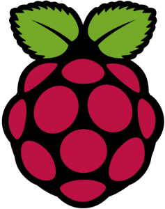
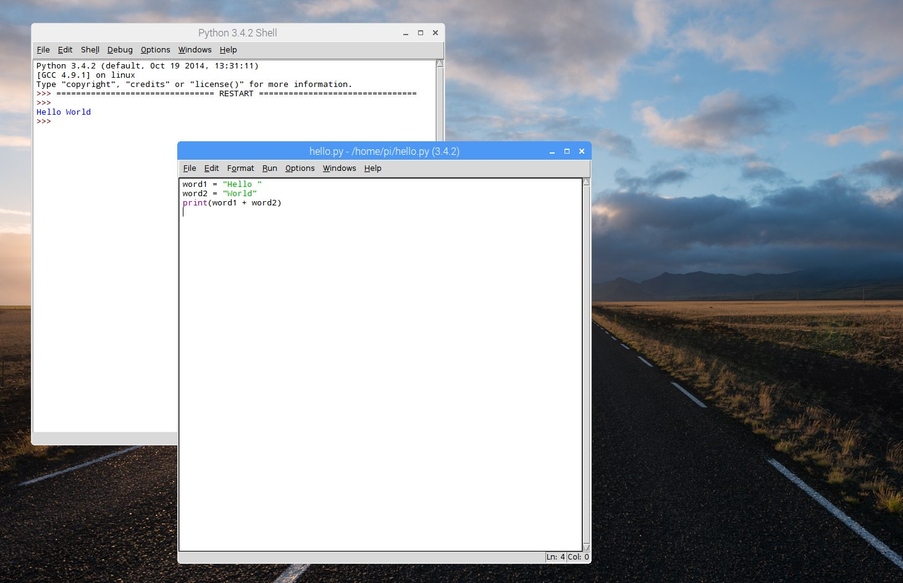

### Raspberry Pi, premiers pas

Ici, je vais vous présenter les Raspberry,
et toujours faire un premier programme (qui fera aussi clignoter une diode)

#### Présentation des Raspberry Pi

Raspberry Pi est une fondation (originaire du Royaume Uni), qui développe
des ordinateurs tenant sur une seule carte, de taille très réduite.
Du coup, on dit souvent que les Raspberry Pi sont sont des **nano-ordinateurs**.
Du coup, un raspberry pi est avant tout... un ordinateur.

Ci desous, le logo des raspberry pi, une célèbre framboise :

Par rapport a ses grands frères comme les PC, il offre de nombreux avantages
pour travailler avec des objets connectés :
- Ils sont petits.
- Ils sont peu cher.
- Ils consomment très peu d'énergie.
- Ils ont des broches pour interagir avec le matériel (comme les cartes
  Arduino vues précédemment)

En revanche, ils sont relativement peu puissants, ce qui nous empecherait de
faire tourner des gros jeux vidéos dessus. Mais leur puissance est tout à fait
adaptée à de nombreux usages.

Il en existe de nombreuses versions. En TP, nous utiliserons la version *3B*
qui offre l'avantage d'intégrer nativement **le wifi**, **le bluetooth**.
Actuellement, il existe un **raspberry 4**, un peu plus cher et un peu plus
puissant.

Comme tout ordinateur, le raspberry pi a besoin d'un **disque dur**, qui est
dans ce cas une carte **micro SD**.
Le raspberry pi a également besoin d'un système d'exploitation qui est, le plus
souvent, un système **Linux**, dans sa variante **Raspbian**, dérivée de la
distribution Linux **Debian**. Ce système d'exploitation, ainsi que tous les
fichiers que vous pourriez créer ou télécharger seront stockés sur la carte
micro SD.

La version du Raspberry Pi que je vous ai présentée en cours est équipée d'un systeme de
fenêtrage qui permet d'interagir avec lui  avec une souris comme pour tout
ordinateur classique ces jours ci (nous verrons dans un autre cours qu'on peut
s'en passer).

J'ai donc branché sur un **clavier usb**, une **souris usb** et un
**écran HDMI** directement sur le raspberry. L'alimentation est en 5V sur un
port **micro USB**. Dans ce premier cours, nous avons utilisé le powerbank

Lorsque le raspberry pi est configuré pour cela, lorsqu'on le met sous tension,
l'ordinateur **boote**, puis vous propose un écran de connection.
Le login par défaut est **pi**, son mot de passe est **raspberry**.

d'un de vos camarades, vu que j'avais oublié mon alim...

Ceci permet alors d'accéder au bureau, géré par un logiciel nommé **pixel**.

Nous sommes donc en présence d'un véritable ordinateur fonctionnel, permettant
notamment de programmer dans toutes sortes de langages (C, java, python...).

Dans notre cas, nous utiliserons Python que nous pouvons lancer pour le moment
avec son environnement de développement.

A gauche, la console ou s'éxecute le programme, à droite, le programme python.
(Pour exécuter un programme dans ce contexte, appuyer sur la touche F5)
