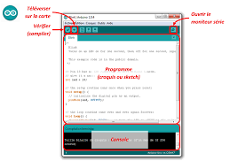

### Introduction aux cartes Arduino

Avant même de faire des objets connectés, il faudrait donc pouvoir programmer
des circuits électroniques. Pour avoir une idée de choses qui nécessitent une des circuits electroniques programmables, considérez un peu :

- la barrière d'entrée de l'université
- un distributeur automatique de boissons.

Ce sont des objets qui ne sont pas forcément connectés, mais dans lequel
on doit effectuer des actions spécifiques lorsque certains évenements se
produisent dans le bon ordre (faire tomber une cochonnerie sucrée lorsque
l'on a mis de l'argent et qu'on a appuyé sur le bon bouton. Accessoirement,
il faut aussi calculer la monnaie à rendre, puis la rendre
(ou blinder la machine contre les coups de genoux)).

Pour faire tout cela, la solution la moins cher consiste
à intégrer dans votre circuit électronique une **carte electronique programmable**. Il en existe énormément de type, de prix très variables.
(ici, je vous mettrais une liste non exhaustive).

Dans le domaine du DIY (Do It Yourself), ce qu'on appelerait sans doute en français le domaine du "je bricole moi même mes trucs de geek", une carte a,
au cours des dernières années, obtenue beaucoup de succès : les cartes
**Arduino**.

#### Les cartes Arduino

Ci dessous, une photo de l'Arduino Uno, très pratique pour les enseignements.


En soi, elle n'ont rien de mieux que les autres, simplements, leurs plans
sont **open source**, copiables, et il existe une documentation très vaste
concernant leur utilisation par des novices.

Cette carte comporte, comme toutes les cartes programmables :

- Un microprocesseur (qui executera le programme)
- une alimentation
- une horloge (qui cadence le programme)
- des broches permettant d'interagir avec le matériel (les boutons, les moteurs, les capteurs ou les lumières)


L'idée est donc de concevoir un programme, qui va prendre en charge
les différents cas qui peuvent se présenter au matériel et déclencher
les évênements voulus.

#### Le logiciel Arduino

Ce programme, dans le cas des cartes Arduino (et très souvent sauf pour
certaines cartes récentes permettant de taper directement le code sur la
carte), est concu sur un ordinateur, pourvu d'un logiciel permettant
de charger ensuite le programme sur la carte.

Lorsque la carte est mise sous tension, ce programme s'éxecute (et on peut
acheter un Mars. Ou un Snickers).

Ce logiciel permettant de préparer son programme et de le charger sur la carte
est également **Open Source** et gratuit dans le cas des cartes Arduino,
ce qui a contribué à leur succès.

Ci dessous, un exemple du logiciel Arduino, permettant de dialoguer avec
l'ensemble des cartes de la famille :


#### Le premier programme

L'équivalent des programmes de type **helloWorld** en électronique
consiste à faire clignoter une diode LED.

Je ne vais pas m'apesantir sur le sujet de la programmation Arduino, car nous
basculeront assez vite sur des Raspberry Pi, mais on retrouve néanmoins de
nombreux points communs entre les programmes sur ces deux types de matériel.

Un programme Arduino est souvent écrit dans un langage proche du **langage C**.
Il comporte deux parties :

- une fonction **setup** qui s'exécute une fois lorsque la carte est mise sous
tension.
- Lorsque le **setup** est terminé, c'est la fonction **loop** qui s'exécute juste en boucle, indéfinimement tant que la carte est sous tension.

Pour faire clignoter une led, il faudrait :

- préparer le circuit electronique (je vais ajouter un schéma un jour)
- brancher ce circuit sur une des broches de la carte (disons la broche 4 par
  exemple)

Le **setup** consisterait a dire : je vais utiliser la broche 4 comme **broche de sortie**

La **loop** pourrait consister a dire :

1. Je met la broche 4 à 5V (a l'état **HAUT**)
2. J'attends un peu (disons une seconde ou 1000 ms)
3. Je met la broche 4 à 0V (a l'état **BAS**)
4. J'attends un peu (disons une seconde ou 1000 ms)

Tout ceci se retrouve dans le programme qui suit :

```C
int brocheLed = 4

// the setup function runs once when you press reset or power the board
void setup() {
  // La broche 4 sera utilisée en SORTIE
  pinMode(brocheLed, OUTPUT);
}

// the loop function runs over and over again forever
void loop() {
  digitalWrite(brocheLed, HIGH);  // Allume la diode
  delay(1000);                    // Attend 1s
  digitalWrite(brocheLed, LOW);   // Eteint la diode
  delay(1000);                    // attend une seconde
}
```
Le programme complet est disponible ici :
[../Sources/Blink.ino](../Sources/Blink.ino)
### Raspberry, premiers pas

Ici, je vais vous présenter les Raspberry,
et toujours faire un premier programme (qui fera aussi clignoter une diode)

___
Vous pouvez repartir vers le [Sommaire](99_sommaire.md)

___
