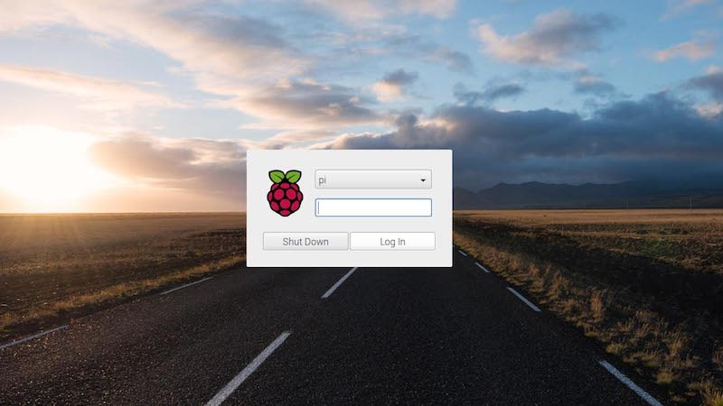
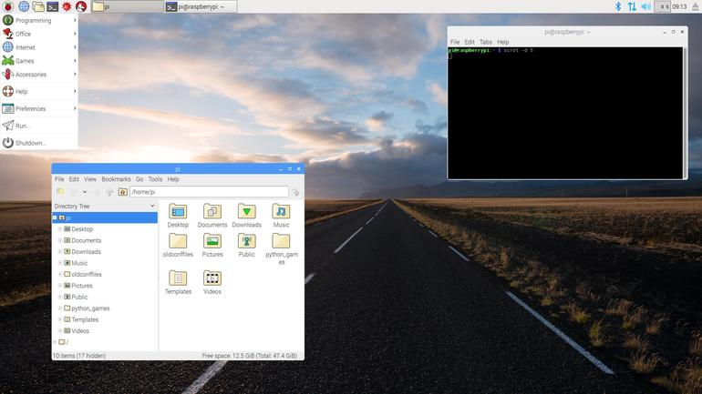

### Introduction aux cartes Arduino

Avant même de faire des objets connectés, il faudrait donc pouvoir programmer
des circuits électroniques. Pour avoir une idée de choses qui nécessitent une des circuits electroniques programmables, considérez un peu :

- la barrière d'entrée de l'université
- un distributeur automatique de boissons.

Ce sont des objets qui ne sont pas forcément connectés, mais dans lequel
on doit effectuer des actions spécifiques lorsque certains évenements se
produisent dans le bon ordre (faire tomber une cochonnerie sucrée lorsque
l'on a mis de l'argent et qu'on a appuyé sur le bon bouton. Accessoirement,
il faut aussi calculer la monnaie à rendre, puis la rendre
(ou blinder la machine contre les coups de genoux)).

Pour faire tout cela, la solution la moins cher consiste
à intégrer dans votre circuit électronique une **carte electronique programmable**. Il en existe énormément de type, de prix très variables.
(ici, je vous mettrais une liste non exhaustive).

Dans le domaine du DIY (Do It Yourself), ce qu'on appelerait sans doute en français le domaine du "je bricole moi même mes trucs de geek", une carte a,
au cours des dernières années, obtenue beaucoup de succès : les cartes
**Arduino**.

#### Les cartes Arduino

Ci dessous, une photo de l'Arduino Uno, très pratique pour les enseignements.


En soi, elle n'ont rien de mieux que les autres, simplements, leurs plans
sont **open source**, copiables, et il existe une documentation très vaste
concernant leur utilisation par des novices.

Cette carte comporte, comme toutes les cartes programmables :

- Un microprocesseur (qui executera le programme)
- une alimentation
- une horloge (qui cadence le programme)
- des broches permettant d'interagir avec le matériel (les boutons, les moteurs, les capteurs ou les lumières)


L'idée est donc de concevoir un programme, qui va prendre en charge
les différents cas qui peuvent se présenter au matériel et déclencher
les évênements voulus.

#### Le logiciel Arduino

Ce programme, dans le cas des cartes Arduino (et très souvent sauf pour
certaines cartes récentes permettant de taper directement le code sur la
carte), est concu sur un ordinateur, pourvu d'un logiciel permettant
de charger ensuite le programme sur la carte.

Lorsque la carte est mise sous tension, ce programme s'éxecute (et on peut
acheter un Mars. Ou un Snickers).

Ce logiciel permettant de préparer son programme et de le charger sur la carte
est également **Open Source** et gratuit dans le cas des cartes Arduino,
ce qui a contribué à leur succès.

Ci dessous, un exemple du logiciel Arduino, permettant de dialoguer avec
l'ensemble des cartes de la famille :


#### Le premier programme

L'équivalent des programmes de type **helloWorld** en électronique
consiste à faire clignoter une diode LED.

Je ne vais pas m'apesantir sur le sujet de la programmation Arduino, car nous
basculeront assez vite sur des Raspberry Pi, mais on retrouve néanmoins de
nombreux points communs entre les programmes sur ces deux types de matériel.

Un programme Arduino est souvent écrit dans un langage proche du **langage C**.
Il comporte deux parties :

- une fonction **setup** qui s'exécute une fois lorsque la carte est mise sous
tension.
- Lorsque le **setup** est terminé, c'est la fonction **loop** qui s'exécute juste en boucle, indéfinimement tant que la carte est sous tension.

Pour faire clignoter une led, il faudrait :

- préparer le circuit electronique (je vais ajouter un schéma un jour)
- brancher ce circuit sur une des broches de la carte (disons la broche 4 par
  exemple)

Le **setup** consisterait a dire : je vais utiliser la broche 4 comme **broche de sortie**

La **loop** pourrait consister a dire :

1. Je met la broche 4 à 5V (a l'état **HAUT**)
2. J'attends un peu (disons une seconde ou 1000 ms)
3. Je met la broche 4 à 0V (a l'état **BAS**)
4. J'attends un peu (disons une seconde ou 1000 ms)

Tout ceci se retrouve dans le programme qui suit :

```c
int brocheLed = 4

// the setup function runs once when you press reset or power the board
void setup() {
  // La broche 4 sera utilisée en SORTIE
  pinMode(brocheLed, OUTPUT);
}

// the loop function runs over and over again forever
void loop() {
  digitalWrite(brocheLed, HIGH);  // Allume la diode
  delay(1000);                    // Attend 1s
  digitalWrite(brocheLed, LOW);   // Eteint la diode
  delay(1000);                    // attend une seconde
}
```
Le programme complet est disponible ici :
[../Sources/Blink.ino](../Sources/Blink.ino)
### Raspberry Pi, premiers pas

Ici, je vais vous présenter les Raspberry,
et toujours faire un premier programme (qui fera aussi clignoter une diode)

#### Présentation des Raspberry Pi

Raspberry Pi est une fondation (originaire du Royaume Uni), qui développe
des ordinateurs tenant sur une seule carte, de taille très réduite.
Du coup, on dit souvent que les Raspberry Pi sont sont des **nano-ordinateurs**.
Du coup, un raspberry pi est avant tout... un ordinateur.

Ci desous, le logo des raspberry pi, une célèbre framboise :


Par rapport a ses grands frères comme les PC, il offre de nombreux avantages
pour travailler avec des objets connectés :
- Ils sont petits.
- Ils sont peu cher.
- Ils consomment très peu d'énergie.
- Ils ont des broches pour interagir avec le matériel (comme les cartes
  Arduino vues précédemment)

En revanche, ils sont relativement peu puissants, ce qui nous empecherait de
faire tourner des gros jeux vidéos dessus. Mais leur puissance est tout à fait
adaptée à de nombreux usages.

Il en existe de nombreuses versions. En TP, nous utiliserons la version *3B*
qui offre l'avantage d'intégrer nativement **le wifi**, **le bluetooth**.
Actuellement, il existe un **raspberry 4**, un peu plus cher et un peu plus
puissant.

Comme tout ordinateur, le raspberry pi a besoin d'un **disque dur**, qui est
dans ce cas une carte **micro SD**.
Le raspberry pi a également besoin d'un système d'exploitation qui est, le plus
souvent, un système **Linux**, dans sa variante **Raspbian**, dérivée de la
distribution Linux **Debian**. Ce système d'exploitation, ainsi que tous les
fichiers que vous pourriez créer ou télécharger seront stockés sur la carte
micro SD.

La version du Raspberry Pi que je vous ai présentée en cours est équipée d'un systeme de
fenêtrage qui permet d'interagir avec lui  avec une souris comme pour tout
ordinateur classique ces jours ci (nous verrons dans un autre cours qu'on peut
s'en passer).

J'ai donc branché sur un **clavier usb**, une **souris usb** et un
**écran HDMI** directement sur le raspberry. L'alimentation est en 5V sur un
port **micro USB**. Dans ce premier cours, nous avons utilisé le powerbank

Lorsque le raspberry pi est configuré pour cela, lorsqu'on le met sous tension,
l'ordinateur **boote**, puis vous propose un écran de connection.
Le login par défaut est **pi**, son mot de passe est **raspberry**.

d'un de vos camarades, vu que j'avais oublié mon alim...


Ceci permet alors d'accéder au bureau, géré par un logiciel nommé **pixel**.



Nous sommes donc en présence d'un véritable ordinateur fonctionnel, permettant
notamment de programmer dans toutes sortes de langages (C, java, python...).

#### Premier programme en Python

Dans notre cas, nous utiliserons Python que nous pouvons lancer pour le moment
avec son environnement de développement.


A gauche, la console ou s'éxecute le programme, à droite, le programme python.
(Pour exécuter un programme dans ce contexte, appuyer sur la touche F5)

Comme précédemment, nous souhaitons faire clignoter une LED, branchée
sur une broche du raspberry. Voyons calmement ce programme.

Tout d'abord, il faut choisir une broche sur laquelle brancher la LED.
Pour cela, il faut disposer du plan
des broches (le **pinout**) qui est présenté ci dessous


On peut voir que les broches sont numérotées de 1 à 40. Par exemple, les
broches 2 et 4 sont a 5V. Les broches 6 et 9 sont a la masse. La broche 8 est
une broche d'interaction nommée *GPIO14*. **GPIO** est l'acronyme de *General
Purpose Input Output*, ce qui signifie "Broches d'entrées / sorties à usage
général".

Un programme qui veut utiliser une de ces broches devra donc la désigner,
soit par son numéro physique sur la carte (la broche 8), soit par le numéro
qui compose son nom de GPIO (14).

Voici le schéma de montage complet. La masse est prise sur la broche physique 6, la broche physique 8 est utilisée pour l'anode (positif) de la LED.


Voyons donc le programme complet, qui suit exactement celui que nous avions
fait pour l'arduino avec quelques petites modifications :

1. On specifie quelle broche est utilisée

2. Puis indéfinimement

  1. On allume la diode
  2. On attend 1s
  3. On eteind la diode
  4. On attend une seconde.


Tout d'abord, il faut dire à python que nous souhaitons utiliser la fonction
*sleep* qui permet de mettre en pause le programme (pour attendre une
seconde). Cette fonction est disponible dans le **module** *time*, que notre
programme doit importer avec la ligne qui suit :

```python
import time
```

A partir de cette ligne, la fonction *sleep* pourrait être appelée
en tapant :
```python
time.sleep(1)
```

Par ailleurs, notre programme doit utiliser les broches.
Pour cela, on **importe le module RPi.GPIO**  qui va nous fournir
les outils pour cela, comme par exemple la fonction *setup* qui permet
de dire qu'une broche va être utilisée en entrée ou en sortie.
On pourait donc importer le module *RPi.GPIO* comme nous l'avons fait pour
le module *time*, mais il faudrait alors apppeler la fonction *setup* comme
suit :
```python
RPi.GPIO.setup(.....)
```
Pour simplifier un peu notre programme, nous allons donc importer le module
*RPi.GPIO* en lui donnant un alias (ici *GPIO*) comme suit.
```python
import RPi.GPIO as GPIO    # Import Raspberry Pi GPIO library
```
Si je veux utiliser la fonction *setup*, je taperais maintenant :
```python
GPIO.setup(.....)
```
Donc pour le moment, nous avons seulement importé nos deux modules
et notre programme ne contient que deux lignes :
```python
import RPi.GPIO as GPIO    # Import Raspberry Pi GPIO library
import time     # Import the time module for the sleep function
```

Ajoutons deux lignes pour lui dire que nous utilisons la broche physique 8,
(aussi appelée GPIO14) comme broche de sortie. On commence par dire au
programme que nous utilisons la numérotation physique des broches (pas son
numéro de GPIO)

```python
GPIO.setmode(GPIO.BOARD)   # Use physical pin numbering
```
Puis on désigne la broche 8 comme broche de sortie :
```python
GPIO.setup(8, GPIO.OUT, initial=GPIO.LOW)
```

Ces deux lignes constituent l'équivalent de ce qui se trouvait dans la fonction *setup* du programme Arduino.

Pour la suite, notre programme doit tourner en boucle indéfiniment,
ce que l'on va faire ici avec une boucle *while*, contenant les 4 étapes
(allume / attend / Eteint / attend)

```python
while True: # Run forever
    GPIO.output(8, GPIO.HIGH) # Turn on
    time.sleep(1)             # Sleep for 1 second
    GPIO.output(8, GPIO.LOW)  # Turn off
    time.sleep(1)             # Sleep for 1 second
```

Le programme complet figure ci dessous.
Il est également téléchargeable dans le répertoire [Sources](../Sources/)
de ce site. Il s'agit du fichier [blinkBoard.py](../Sources/blinkBoard.py).

```python
import RPi.GPIO as GPIO    # Import Raspberry Pi GPIO library
import time     # Import the time module for the sleep function

GPIO.setmode(GPIO.BOARD)   # Use physical pin numbering
GPIO.setup(8, GPIO.OUT, initial=GPIO.LOW)   # Set pin 8 to be an output pin and set initial value to low (off)

while True: # Run forever
    GPIO.output(8, GPIO.HIGH) # Turn on
    time.sleep(1)                  # Sleep for 1 second
    GPIO.output(8, GPIO.LOW)  # Turn off
    time.sleep(1)
```

On peut alors lancer ce programme et constater avec plaisir que notre diode
clignote. Elle ne s'arrêtera jamais. Pour stopper le programme, il faut
demander au système d'exploitation de l'arrêter, ce que l'on ferait en
appuyant sur **CTRL** et **C** simultanément (noté **CTRL C**)

Pour raffiner un petit peu, j'aurais tendance à définir une variable
pour contenir le numéro de la broche de la diode (si je veux modifier,
ce sera plus simple). Mon programme deviendrait :

```python
import RPi.GPIO as GPIO    # Import Raspberry Pi GPIO library
import time     # Import the time module for the sleep function


GPIO.setmode(GPIO.BOARD)   # Use physical pin numbering

ledpin = 8
GPIO.setup(ledpin, GPIO.OUT, initial=GPIO.LOW)   # Set pin 8 to be an output pin and set initial value to low (off)

while True: # Run forever
    GPIO.output(ledpin, GPIO.HIGH) # Turn on
    time.sleep(1)                  # Sleep for 1 second
    GPIO.output(ledpin, GPIO.LOW)  # Turn off
    time.sleep(1)
```

Par ailleurs, j'aurais aussi tendance a définir une variable pour contrôler
la durée totale d'un cycle (ici, 2 secondes) ce qui me permettrait de faire
clignoter ma diode plus ou moins vite. La diode reste allumée la moitié
d'un cycle puis éteinte la moitié d'un cycle. Mon programme deviendrait :

```python
import RPi.GPIO as GPIO    # Import Raspberry Pi GPIO library
import time     # Import the time module for the sleep function


GPIO.setmode(GPIO.BOARD)   # Use physical pin numbering

ledpin = 8
GPIO.setup(ledpin, GPIO.OUT, initial=GPIO.LOW)   # Set pin 8 to be an output pin and set initial value to low (off)

dureeCycle = 2 # En secondes

while True: # Run forever
    GPIO.output(ledpin, GPIO.HIGH) # Turn on
    time.sleep(dureeCycle * 0.5 )                  # Sleep for 1 second
    GPIO.output(ledpin, GPIO.LOW)  # Turn off
    time.sleep(dureeCycle * 0.5)
```

Notons enfin que notre programme utilise la broche 8. En fait, il a demandé
le contrôle de cette broche au Raspberry (qui lui donne de bon coeur).
En revanche, il faudrait que quand le programme s'interromp, il libère toutes
les broches utilisées. Ceci pourrait être fait avec la fonction *GPIO.cleanup()*.

Le problème est qu'il faudrait faire ceci quand notre programme s'arrete, et il ne s'arretera que quand on l'interromppra avec **CTRL C**.
On va donc dire au programme : Tourne indéfiniment, et si une interruption
de type CTRL C arrive, libère les broches.

Le programme complet serait alors, disponible ici : [blinkBoardClean.py](../Sources/blinkBoardClean.py)

```python
import RPi.GPIO as GPIO    # Import Raspberry Pi GPIO library
import time     # Import the time module for the sleep function

GPIO.setmode(GPIO.BOARD)   # Use physical pin numbering

ledpin = 8
GPIO.setup(ledpin, GPIO.OUT, initial=GPIO.LOW)   # Set pin 8 to be an output pin and set initial value to low (off)

dureeCycle = 2 # En secondes
try:    
    while True: # Run forever
        GPIO.output(ledpin, GPIO.HIGH) # Turn on
        time.sleep(dureeCycle * 0.5 )                  # Sleep for 1 second
        GPIO.output(ledpin, GPIO.LOW)  # Turn off
        time.sleep(dureeCycle * 0.5)

except KeyboardInterrupt:  
    GPIO.cleanup()       # clean up GPIO on CTRL+C exit  
```

Et voila !

___
Vous pouvez repartir vers le [Sommaire](Cours/99_sommaire.md)

___
