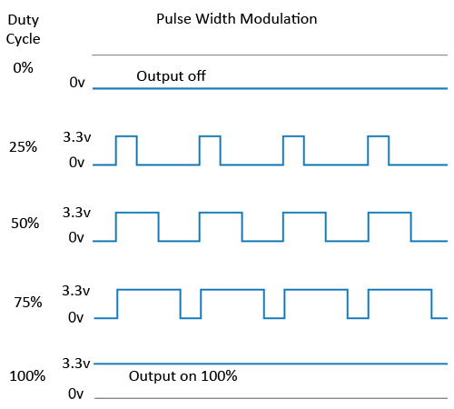

## PWM sur un Raspberry Pi

### Raspberry Pi : des broches Numériques.

Au cours du premier cours, nous avions vu comment allumer et éteindre une LED.
Il est temps de clarifier un peu les choses pour aller plus loin et voir
ce qu'il est possible de faire ou pas avec les Raspberry Pi.

Tout d'abord, je vous avais signalé que les broches du Raspberry peuvent
être à l'état HAUT ou Bas. Ce sont des broches **numériques**.

Formalisons un peu cela : le Raspberry est alimenté en 5V.
Ses broches fonctionnent en **3.3 V**. L'état HAUT est donc une tension
de 3.3V, l'état BAS, une tension de 0V.

Qu'est ce que cela implique ?
Il n'y a pas de broche analogique sur un Raspberry Pi.
On peut donc lire ou écrire des
valeurs *0* ou *1*, mais en aucun cas *0.5*.

A vrai dire, si on applique 0.2V sur une broche d'entrée, le Raspberry la lira
comme un état BAS. Si on applique 2.8V, il lira un état HAUT)

De ce fait, il semble impossible d'allumer une lampe avec une intensité
variable sur un Raspberry, la lampe ne pouvant être que Allumée ou Eteinte.

### PWM : principe

Pour y arriver néanmoins, on va utiliser une feinte, dite **PWM** pour *Pulse Width Modulation*.

Lorsque l'on fixe l'état HAUT d'une broche, cela signifie que,
durant un cycle, de durée spécifique, l'état de la broche est HAUT.
Si l'on souhaite envoyer moitié moins de puissance à la broche,
on peut simplement mettre cette broche à l'état HAUT durant la moitié
du cycle.

Si la durée du cycle est très faible, on ne pourra pas voir que la lampe
s'allume puis s’éteint, on ne verra qu'une lampe allumée avec une intensité
plus faible.

Dans le cas d'un moteur, même principe permettrait de faire varier la vitesse
du moteur...

Voici une image représentant ces cycles, empruntée ici [https://www.mbtechworks.com/projects/raspberry-pi-pwm.html](https://www.mbtechworks.com/projects/raspberry-pi-pwm.html)



La proportion de temps au cours d'un cycle pendant lequel la broche est
allumée est appelée **Duty Cycle**.


### PWM : programmes Python

#### Premier programme

Commençons par allumer une diode avec une valeur de duty cycle fixée par une
variable. Le programme commence comme précédemment.

```python
import RPi.GPIO as GPIO   # Import the GPIO library.
import time               # Import time library

GPIO.setmode(GPIO.BOARD)  # Set Pi to use pin number when referencing GPIO pins.

ledpin = 8


GPIO.setup(ledpin, GPIO.OUT)  # Set GPIO pin 12 to output mode.
```

Puis, nous demandons un objet PWM pour gérer la broche de la led.
Au passage, nous fixons la fréquence des cycles à 100 Hz (donc la durée d'un
cycle à 0.01s)

```python

freq = 100 # en Hz
pwm = GPIO.PWM(ledpin, freq)   # Initialize PWM on pwmPin 100Hz frequency
```

On fixe ensuite la valeur du duty cycle en fonction des besoins. Cette valeur
peut fluctuer entre 0 (HAUT 0% du cycle) et 100 (HAUT 100% du cycle).

```python
dc = 50
pwm.ChangeDutyCycle(dc)
```

Avec ceci, votre diode s'allume moins fortement qu'avec le programme du cours
précédent.
Le code complet de ce programme est ici :
[../Sources/BlinkPwm01.py](../Sources/BlinkPwm01.py)

En mixant ce principe avec nos compétences de programmation,
nous pouvons faire de nombreuses choses.

#### Demander à l'utilisateur de choisir une intensité

pour cela, il suffit de faire une boucle dans laquelle on demande à
l'utilisateur quelle intensité il souhaite, puis de fixer le duty cycle
à cette valeur. Tant que l'utilisateur n'aura pas entré de nouvelle
valeur, ce duty cycle ne change pas.

```python
while True :
    print ("entrez l'intensité souhaitée")
    dc = int (input() )
    pwm.ChangeDutyCycle(dc)
```

Le code complet de ce programme est ici :
[../Sources/BlinkPwm02.py](../Sources/BlinkPwm02.py)

#### Faire croitre l'intensité d'une led

Encore une fois, c'est relativement simple, il faut une variable qui croit
à chaque tour de boucle, puis on atteint 0.1 seconde avant de changer la valeur
du duty cycle. Si la valeur du Duty cycle passe au dessus de 100, on la
contraint à rester à 100.

```python
dc = 0

while True :
    print ("duty cycle",dc)
    pwm.ChangeDutyCycle(dc)

    dc+= 1

    if dc > 100:
      dc = 100

    time.sleep(0.1)
```

Le code complet de ce programme est ici :
[../Sources/BlinkPwm02.py](../Sources/BlinkPwm03.py)

#### la led qui s'allume et s'eteint progressivement

Même principe mais quand le duty cycle arrive a 100, il faut redescendre.
Quand il arrivera à 0, il faudra remonter.

Nous avons vu en cours que cela nécessitait une nouvelle variable
(ici *step*) qui contienne la direction actuelle (monte ou descend)
lorsqu'on arrive a une limite, on inverse la direction.


```python
dc = 0
step = +1

while True :
    print ("duty cycle",dc)
    pwm.ChangeDutyCycle(dc)
    dc+= step

    if dc >= 100 or dc <= 0:
      step *= -1

    time.sleep(0.1)

```

Le code complet de ce programme est ici :
[../Sources/BlinkPwm02.py](../Sources/BlinkPwm03.py)

C'est tout pour le cours 2.
