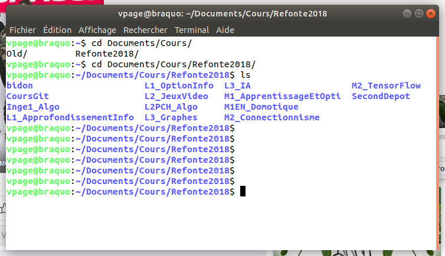

## Connection au Raspberry en SSH

Pour aller un peu plus loin avec le Raspberry Pi, il va nous falloir
nous intéresser un peu au monde Linux, de façon à interagir avec lui à travers
un terminal (à la fin de ce cours, nous le ferons depuis un autre ordinateur).

Du coup, il me faut vous raconter deux ou trois choses sur Linux / Unix :

### Le kit de survie Linux.

Tout d'abot, il nous faut comprendre comment est organisé l'**arborescence des fichiers** sous Linux.

Dans le monde Linux, tous les fichiers de l'ordinateur sont stockés dans un seul arbre. La **racine** de cette arborescence est notée **/**
Tous les autres fichiers sont quelque part à l'intérieur de cette racine.

A la racine, on trouve des sous répertoires, comme :

- */home/* qui contient les comptes de tous les utilisateurs (sauf un...)
- */etc/* qui contient des fichiers de configuration.
- */bin/* qui contient la plupart des programmes executables.
- ...

Ces répertoires peuvent contenir des sours répertoires et/ou des fichiers.

Enfin, dans chaque répertoire, on trouve deux autres sous répertoires :
- *.* qui désigne le répertoire lui même
- *..* qui désigne le répertoire parent. Par exemple */home/vpage/..**
est en fait */home/*


De plus, Linux permet, depuis toujours, à plusieurs utilisateurs de partager
le même ordinateur.

Chaque utilisateur est caractérisé par son *login* et il se connecte sur la machine par l'intermédiaire de son login et de son *mot de passe*. Chaque utilisateur dispose d'un répertoire personnel, appelé **home directory**,
stocké dans */home/* et qui contiendra tous ses fichiers.

Par exemple, si mon login est *vpage*, mon repertoire personnel sera (le plus
souvent) : */home/vpage*, dans lequel je pourrais créer des sous répertoires
pour ranger mes programmes, mes images...

Enfin, il existe un utilisateur spécial : **root** qui dispose des
droits d'administration (certains utilisateurs auront le droit de passer
momentanément **root** pour effectuer ces actions, nous reviendrons la dessus plus loin). Dans une distribution *Debian* comme celle qui tourne sur nos Raspberry Pi, cet utilisateur ne se connecte jamais directement.

Pour l'utilisation de Linux avec un gestionnaire d'écran, pas besoin de cours,
tout est a peu près intuitif. Vous aurez les mêmes façon d'interagir avec
l'ordinateur qu'avec les autres Systèmes d'exploitation (Windows, Mac Os) et le
même temps d'acclimatation à l'interface.

Néanmoins, il est très fréquent que certaines opérations doivent être faites
en **ligne de commande**, dans un terminal. Voyons donc le minimum vital pour
survivre en ligne de commande.

#### La ligne de commande Bash

Quand on se trouve face à un terminal, on voit ce genre de choses :



On tape ses commandes sur la ligne qui clignote (le **prompt**).
Ce **prompt** donne en général quelques informations :

1. Dans l'image, l'utilisateur a pour login *vpage*
2. l'ordinateur sur lequel je travaille s'appelle *braquo*
3. je suis actuellement dans le répertoire */home/vpage/Documents/Cours/Refonte2018* . Ce répertoire est appelé **répertoire courant**.

Évidemment, si je me déplace dans l'arborescence, le répertoire
courant change... Le répertoire courant est le répertoire ou je suis
actuellement.

##### Les commandes les plus usuelles

Vite fait, quelques commandes utiles :


- **pwd** (path of working directory) affiche le chemin du répertoire courant)


- **ls** (list) : affiche les répertoires et les fichiers d'un répertoire)
On peut ainsi taper :
  - *ls* : cela liste les fichiers du répertoire courant.
  - *ls /home/vpage/* : cela liste les fichiers du répertoire /home/vpage/

- **cd** (change directory) ; permet de changer de répertoire.
On peut ainsi taper :

  - *cd /home/vpage/Document* pour aller dans le répertoire
  */home/vpage/document*
  - *cd monRepertoire* pour aller dans le sous repertoire *monRepertoire* du
  répertoire courant.
  - *cd ..* (répertoire parent)
  - *cd ~* (home directory)

- **mkdir** (make directory) : créer un répertoire. la commande *mkdir Truc*
va créer un répertoire nommé *Truc* dans le répertoire courant

- **rm** (remove) : effacer des fichiers, des dossiers.
On pourra taper les commandes :
  - *rm toto* : pour effacer le fichier *toto* du répertoire courant.
  - *rm -r monRep* : pour effacer le répertoire *monRep* du répertoire courant.

- **cp** (copy) : fait une copie du fichier. par exemple, *cp toto.txt sauvegarde.txt* fait une copie du fichier *toto.txt* du répertoire courant, et
la sauve sous le nom *sauvegarde.txt*, toujours dans le répertoire courant.

Pour toutes ces opérations, n'oubliez pas, comme vu en cours, qu'il est souvent
inutile de taper le nom complet des commandes, des fichiers ou des répertoires.
La touche <TAB> vous permet de demander la **complétion** des noms, ce qui
permet de gagner beaucoup de temps (et de ne pas faire d'erreurs).

On peut aussi, depuis le terminal, lancer des programmes en les appelant par
leur nom. Dans un contexte de programmation en python, il nous faudra par
exemple lancer

1. un **editeur de texte** pour écrire notre programme (*toto.py*).
2. l’interpréteur python pour exécuter ce programme.

##### Editeurs de texte dans le terminal.

Il en existe de multiples. En voici trois :

- *vi* : très efficace, mais sa prise en main est délicate.
- *emacs* : pas moins efficace, prise en main un peu plus facile.
- *nano* : basique mais facile d'utilisation.

Si vous débutez, je vous conseille *nano* le temps de vous familiariser avec
votre terminal. Vous pourrez toujours vous intéresser à *vi* ou *Emacs* le
jour où vous aurez compris ce que cela apporte (en gros, un gain de temps sur
toutes vos opérations).

Mettons que je sois dans mon **home directory**, et que je veuille y créer un
chemin *M1/Prog/* dans lequel ranger un fichier **blink.py** puis le lancer,
voici la liste des commandes :

```bash
mkdir M1
mkdir M1/Prog
cd M1/Prog
nano blink.py
python blink.py
```

Avec cela, on doit pouvoir survivre pour la suite.

### SSH

comment ca marche

### Le monde Linux et son terminal

- les utilisateurs
- commandes usuelles.
- completion
- systeme de fichier
- lancement de programme
- sudo

___
Vous pouvez repartir vers le [Sommaire](99_sommaire.md)

___
