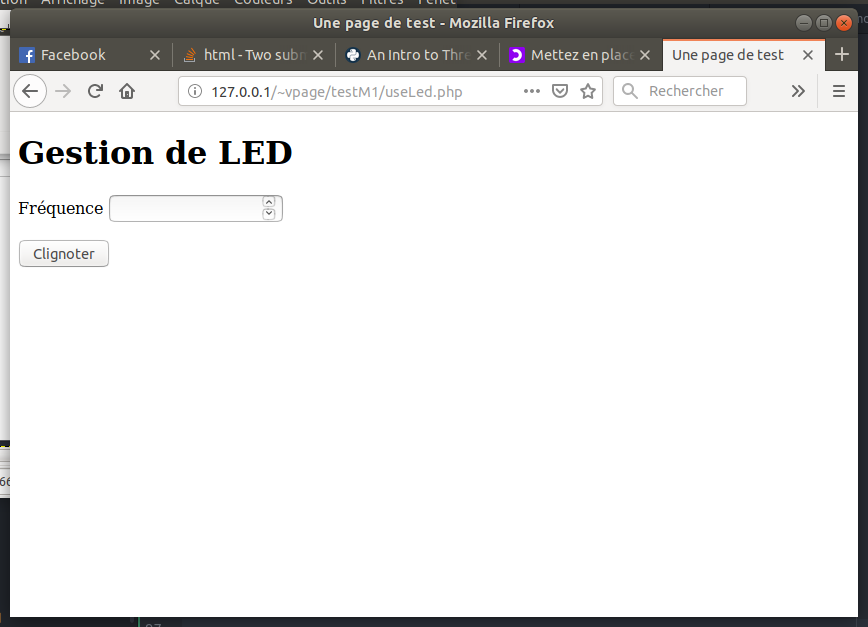

## Amélioration de la gestion des LED

### Introduction

Ici, nous voulons que l'on puisse, par exemple,
faire clignoter une diode avec une fréquence définie.

Le problème est le suivant :
Nos programmes précédents allumaient la diode une seconde
puis s’arrêtaient.

Ici, le programme python qui pilote la diode doit :
- tourner en permanence (et faire clignoter)
- écouter le serveur web à l'écoute d'une nouvelle consigne.

Notre programme python va donc se comporter comme un **serveur**
(un logiciel qui tourne en permanence). Ce serveur sera le programme *serverLed.py*

Il faudra que le serveur web **contacte** le serveur
en tant que **client** pour envoyer ses consignes.

Pour rester le plus possible en Python, le nouveau mécanisme va
être le suivant :
quand on clique sur le bouton :
1. on appelle le formulaire *useLed.php*.
2. celui ci lance un programme python : *clientLed.py*
3. *clientLed.py* contacte *serverLed.py* pour lui donner ses consignes
4. *serverLed.py* actualise le comportement de la LED.

De fait, le programme *useLed.php* pourrait directement contacter
le programme *serverLed.py* mais j'ai souhaité que PHP ne fasse
que lancer du python.

Ceci nécessite deux ou trois nouvelles petites choses,
telles que des **sockets** et des **threads**...
Mais avant cela, préparons le fichier Php

### Code PHP

Reprenons le code précédent vu auparavant, que l'on adapte
puisque son nom est *useLed.php* et qu'il appelle le fichier
python *clientLed.py*. J'ai également ajouté un titre de niveau 1
dans la page page (Gestion de Led)

```html
<!DOCTYPE html>
<html>
<head>
    <meta charset="utf-8">
    <title> Une page de test </title>
</head>

<body>
  <h1> Gestion de LED </h1>
  <form action="useLed.php" method="post">
    <button type="submit" id="submit" name="submit">Allumer</button>
  </form>

  <?php
  if (isset($_POST["submit"])){
      $command = escapeshellcmd('python3 clientLed.py');
      $output = shell_exec($command);

      echo "<p>";
      echo $output;
      echo </p>
  }
  ?>
</body>
</html>
```

Ajoutons dans le formulaire un champ pour la fréquence :

- On ajoute un paragraphe pour bien séparer les champs. Ceci grâce à la balise \<p\>,
- on ajoute un label pour écrire "Fréquence" devant le champ.
- on ajoute le champ *freq* pour que l'utilisateur puisse entrer
un nombre.

Voici le code du formulaire, qui remplace l'ancien :

```html
<form action="useLed.php" method="post">

  <p>
    <label for="freq">Fréquence</label>
    <input type="number" name="freq" id="freq" />
 </p>
   <button type="submit" id="submit" name="submit">Clignoter</button>

</form>

```

On vérifie que l'affichage fonctionne :




Ajoutons que le script Php doit récupérer la valeur de la fréquence
qu'il recoit du formulaire, et la transmettre au programme python qu'il lance.

Pour récuperer cette valeur, on regarde dans *\$_POST*
```
$frequence = $_POST["submit"]
```

Pour transmettre cela au programme python qu'on lance,
il faut que la commande devienne :
```
python3 clientLed.py $frequence
```

je vais changer les simples guillemets du programme précédent
par des doubles, ce qui va permettre a PHP de remplacer *\$frequence*
par sa valeur
```
<?php

if (isset($_POST["submit"])){
    $frequence = $_POST["submit"];

    $command = escapeshellcmd("python3 clientLed.py $frequence");
    $output = shell_exec($command);
```

Pour vérifier, on va faire un programme python *clientLed.py* tout bête qui
affiche la valeur du paramètre avec lequel il est lancé.

```python
import sys

freq = sys.argv[1]
print ("Je suis python, vous voulez une fréquence de :", freq)
```

Ceci nous permettra d'avoir ce type de choses :


