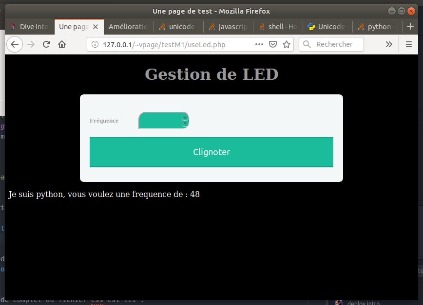

### Un peu de style.

Rendons ceci plus joli : on va utiliser les Feuilles de styles (CSS) pour
améliorer visuellement notre formulaire.
C'est une bonne habitude de mettre les instructions de style dans
un fichier séparé du code HTML. Ce fichier s'appellera ici *styleM1.css*

Commencons par dire, dans le fichier PHP, que le navigateur doit récuperer
ce fichier pour la mise en page. Ceci se fait dans la balise *head*,
en ajoutant la ligne suivante :

```
 <link rel="stylesheet" href="styleM1.css" />
```

Je n'ai pas l'intention ici de faire un cours complet sur les CSS (c'est long),
juste de vous en apprendre quelques notions.
Dans un fichier css, on veut définir des **instructions de style** appliquer à certains **éléments** de la page HTML.

Les éléments sont choisis avec un **sélecteur**, comme par exemple le nom d'une
balise. Puis on définit la **valeur** d'une **propriété** pour ce sélécteur.

Par exemple : Si je veux mettre un fond noir sur toute ma page,
je dois selectionner la balise *body*, et donner à la propriété
*background-color* la valeur *black* (ou *#000000*).
Dans mon CSS, j'écrirais :
```
body
{
    background-color: black;  /* Le fond de la page sera noir */
}
```
En bricolant un peu (et en repompant des styles sur le net), on arrive à ceci :




Le code complet du fichier PHP est ici : [../Sources/useLed.php](../Sources/useLed.php)


Le code complet du fichier css est ici : [../Sources/styleM1.css](../Sources/styleM1.css)
