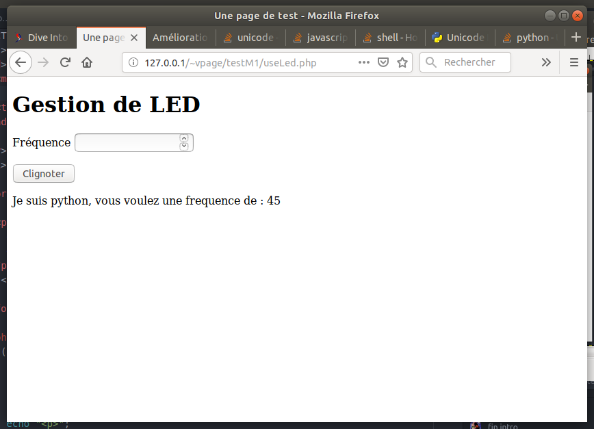

## Amélioration de la gestion des LED

### Introduction

Ici, nous voulons que l'on puisse, par exemple,
faire clignoter une diode avec une fréquence définie.

Le problème est le suivant :
Nos programmes précédents allumaient la diode une seconde
puis s’arrêtaient.

Ici, le programme python qui pilote la diode doit :
- tourner en permanence (et faire clignoter)
- écouter le serveur web à l'écoute d'une nouvelle consigne.

Notre programme python va donc se comporter comme un **serveur**
(un logiciel qui tourne en permanence). Ce serveur sera le programme *serverLed.py*

Il faudra que le serveur web **contacte** le serveur
en tant que **client** pour envoyer ses consignes.

Pour rester le plus possible en Python, le nouveau mécanisme va
être le suivant :
quand on clique sur le bouton :
1. on appelle le formulaire *useLed.php*.
2. celui ci lance un programme python : *clientLed.py*
3. *clientLed.py* contacte *serverLed.py* pour lui donner ses consignes
4. *serverLed.py* actualise le comportement de la LED.

De fait, le programme *useLed.php* pourrait directement contacter
le programme *serverLed.py* mais j'ai souhaité que PHP ne fasse
que lancer du python.

Ceci nécessite deux ou trois nouvelles petites choses,
telles que des **sockets** et des **threads**...
Mais avant cela, préparons le fichier Php

### Code PHP

Reprenons le code précédent vu auparavant, que l'on adapte
puisque son nom est *useLed.php* et qu'il appelle le fichier
python *clientLed.py*. J'ai également ajouté un titre de niveau 1
dans la page page (Gestion de Led)

```
<!DOCTYPE html>
<html>
<head>
    <meta charset="utf-8">
    <title> Une page de test </title>
</head>

<body>
  <h1> Gestion de LED </h1>
  <form action="useLed.php" method="post">
    <button type="submit" id="submit" name="submit">Allumer</button>
  </form>

  <?php
  if (isset($_POST["submit"])){
      $command = escapeshellcmd('python3 clientLed.py');
      $output = shell_exec($command);

      echo "<p>";
      echo $output;
      echo </p>
  }
  ?>
</body>
</html>
```

Ajoutons dans le formulaire un champ pour la fréquence :

- On ajoute un paragraphe pour bien séparer les champs. Ceci grâce à la balise \<p\>,
- on ajoute un label pour écrire "Fréquence" devant le champ.
- on ajoute le champ *freq* pour que l'utilisateur puisse entrer
un nombre.

Voici le code du formulaire, qui remplace l'ancien :

```
<form action="useLed.php" method="post">

  <p>
    <label for="freq">Fréquence</label>
    <input type="number" name="freq" id="freq" />
 </p>
   <button type="submit" id="submit" name="submit">Clignoter</button>

</form>

```

On vérifie que l'affichage fonctionne :


Ajoutons que le script Php doit récupérer la valeur de la fréquence
qu'il recoit du formulaire, et la transmettre au programme python qu'il lance.

Pour récuperer cette valeur, on regarde dans *\$_POST*
```
$frequence = $_POST["submit"]
```

Pour transmettre cela au programme python qu'on lance,
il faut que la commande devienne :
```
python3 clientLed.py $frequence
```

je vais changer les simples guillemets du programme précédent
par des doubles, ce qui va permettre a PHP de remplacer *\$frequence*
par sa valeur
```
<?php

if (isset($_POST["submit"])){
    $frequence = $_POST["submit"];

    $command = escapeshellcmd("python3 clientLed.py $frequence");
    $output = shell_exec($command);
```

Pour vérifier, on va faire un programme python *clientLed.py* tout bête qui
affiche la valeur du paramètre avec lequel il est lancé.

```
import sys

freq = sys.argv[1]
print ("Je suis python, vous voulez une fréquence de :", freq)
```

Ceci nous permettra d'avoir ce type de choses :


### Un peu de style.

Rendons ceci plus joli : on va utiliser les Feuilles de styles (CSS) pour
améliorer visuellement notre formulaire.
C'est une bonne habitude de mettre les instructions de style dans
un fichier séparé du code HTML. Ce fichier s'appellera ici *styleM1.css*

Commencons par dire, dans le fichier PHP, que le navigateur doit récuperer
ce fichier pour la mise en page. Ceci se fait dans la balise *head*,
en ajoutant la ligne suivante :

```
 <link rel="stylesheet" href="styleM1.css" />
```

Je n'ai pas l'intention ici de faire un cours complet sur les CSS (c'est long),
juste de vous en apprendre quelques notions.
Dans un fichier css, on veut définir des **instructions de style** appliquer à certains **éléments** de la page HTML.

Les éléments sont choisis avec un **sélecteur**, comme par exemple le nom d'une
balise. Puis on définit la **valeur** d'une **propriété** pour ce sélécteur.

Par exemple : Si je veux mettre un fond noir sur toute ma page,
je dois selectionner la balise *body*, et donner à la propriété
*background-color* la valeur *black* (ou *#000000*).
Dans mon CSS, j'écrirais :
```
body
{
    background-color: black;  /* Le fond de la page sera noir */
}
```
En bricolant un peu (et en repompant des styles sur le net), on arrive à ceci :


Le code complet du fichier PHP est ici : [../Sources/useLed.php](../Sources/useLed.php)


Le code complet du fichier css est ici : [../Sources/styleM1.css](../Sources/styleM1.css)
### Clignotement.

Oublions un instant le serveur web et  voyons comment faire clignoter proprement.
Comme je n'ai pas de Raspberry sous la main, je vais simuler avec un
programme qui affiche des choses.

L'idée du clignotement est la suivante :

```
import time

clignote = True
while clignote:
  print ("allume")
  time.sleep(1)
  print ("eteint")
  time.sleep(1)
```

Si l'on veut prendre en compte une valeur passée
de fréquence, cela deviendrait :

```
import time

freq = 1 # en Hz
t = 1/freq

clignote = True

while clignote:
  print ("allume")
  time.sleep(t/2)
  print ("eteint")
  time.sleep(t/2)
```

Disons que l'on veuille changer la fréquence quand l'utilisateur
tape une nouvelle valeur au clavier...
cette partie du code serait :

```
print("Entrez la fréquence")
freq = float(input());
```

Le problème est que je ne peux pas intégrer ces lignes dans la boucle :
l'attente de l'utilisateur bloque le clignotement.
Inversement, les *sleep* du clignotement pourraient empécher la réception des
arrivées de demande de changement de fréquence (pas dans le cas du clavier,
mais si cela venait du réseau, oui)

Le code qui suit **ne permet donc pas** de clignoter :
```
import time

freq = 1 # en Hz
t = 1/freq

clignote = True

while clignote:
  print ("allume")
  time.sleep(t/2)
  print ("eteint")
  time.sleep(t/2)

  print("Entrez la fréquence")
  freq = float(input());
```

Notre programme doit donc avoir deux parties :
- une qui clignote
- une qui attend.

Pour cela, nous allons utiliser des **Threads**

### Les Threads

Bon, on va dire que ce sont presque des processus qui s'exécutent
parallèlement dans un programme.

Commencons par créer une fonction qui clignote.
Cette fonction utilise les **variables globales** suivantes :
- clignote (boolean)
- freq (un float)

```
def clignoter():
  while clignote:
      t = 1/freq
      print ("allume")
      time.sleep(t/2)
      print ("eteint")
      time.sleep(t/2)
```

Mon programme principal va alors créer un thread
qui exécute cette fonction *clignoter*.
Le programme principal reste donc libre de faire autre chose...

On définit le thread à créer comme suit :
```
monThread = threading.Thread(target=clignoter)
```
On le lance comme cela.
```
monThread.start()
```

Voici donc un premier programme complet,
qui clignote, tout en affichant d'autres choses.

```
# -*- coding: utf-8 -*-
import time
import threading

def clignoter():
  while clignote:
      t = 1/freq
      print ("allume")
      time.sleep(t/2)
      print ("eteint")
      time.sleep(t/2)


freq = 0.5 # en Hz
clignote = True

monThread = threading.Thread(target=clignoter)
monThread.start()

while True:
     print("pg principal")
     time.sleep(2)
```

Ne lancez pas ce programme, vous auriez du mal a arrêter le thread...
Ajoutons donc quelques lignes pour que tout s'arrête proprement si on appuie
sur CTRL + C... Il suffit que si le programme principal s'arrête, la variable
*clignote* passe à *False*. Ainsi, la boucle du thread s’arrêtera et le thread
se terminera avec la fonction *clignoter*.

Voici le code du programme principal seul :

```
freq = 0.5 # en Hz
clignote = True

try:

    monThread = threading.Thread(target=clignoter)
    monThread.start()

    while True:
        print("pg principal")
        time.sleep(2)

except (KeyboardInterrupt, SystemExit):
    clignote = False
```

Il ne reste plus qu'a prendre en compte les choix de l'utilisateur,
c'est facile. Voici le code du programme complet :
```
# -*- coding: utf-8 -*-
import time
import threading

def clignoter():
  while clignote:
      t = 1/freq
      print ("allume")
      time.sleep(t/2)
      print ("eteint")
      time.sleep(t/2)

  print("j'arrete de clignoter")

freq = 0.5 # en Hz
clignote = True

try:

    monThread = threading.Thread(target=clignoter)
    monThread.start()

    while True:
         print("pg principal")
         print ("entrez la frequence souhaitee")
         freq = float(input())

except (KeyboardInterrupt, SystemExit):
    clignote = False
    print ("je sors du programme principal")
```

### Modification pour intégrer les Leds

On transforme ceci un petit peu...
Il suffit d'injecter le code de cligntement des leds dans notre fonction.
On pourrait faire ceci :
```
def clignoter():
  broche = 8
  GPIO.setmode(GPIO.BOARD)  
  GPIO.setup(broche, GPIO.OUT, initial=GPIO.LOW)

  while clignote:
      t = 1/freq

      GPIO.output(broche, GPIO.HIGH) # Turn on
      time.sleep(t/2)

      GPIO.output(broche, GPIO.LOW)  # Turn off
      time.sleep(t/2)

  print("j'arrete de clignoter")
```

Une remarque néanmoins :
Je souhaite que le numéro de broche soit choisi par le programme principal
(car potentiellement, je voudrais en faire clignoter plusieurs en meme temps).

C'est aussi le programme principal qui définira que cette broche est une broche
de sortie.

Je pourrais faire de broche une variable globale mais c'est moche
(et rendrait difficile d'en faire clignoter plusieurs en meme temps)

Je vais donc passer ce numéro de broche à ma fonction clignoter, qui devient :

```
def clignoter(broche):
  GPIO.setmode(GPIO.BOARD)  
  GPIO.setup(broche, GPIO.OUT, initial=GPIO.LOW)

  while clignote:
      t = 1/freq

      GPIO.output(broche, GPIO.HIGH) # Turn on
      time.sleep(t/2)

      GPIO.output(broche, GPIO.LOW)  # Turn off
      time.sleep(t/2)

  print("j'arrete de clignoter")
```

Il s'agit maintenant, pour le programme principal, de creer un thread
qui execute la fonction *clignoter* en lui passant le numéro de broche
comme argument.
Dans mon programme principal, je vais donc trouver ceci :

```
ledpin = 8
GPIO.setmode(GPIO.BOARD)                        # Use physical pin numbering
GPIO.setup(ledpin, GPIO.OUT, initial=GPIO.LOW)

try:

    monThread = threading.Thread(target=clignoter, args=(ledpin,))
    monThread.start()
```

Au final, voici le code complet :

```python
# -*- coding: utf-8 -*-
import time
import threading
import RPi.GPIO as GPIO    # Import Raspberry Pi GPIO library


def clignoter(broche):

  while clignote:
      t = 1/freq

      GPIO.output(broche, GPIO.HIGH) # Turn on
      time.sleep(t/2)

      GPIO.output(broche, GPIO.LOW)  # Turn off
      time.sleep(t/2)

  print("j'arrete de clignoter")

freq = 0.5 # en Hz
clignote = True

ledpin = 8
GPIO.setmode(GPIO.BOARD)                        # Use physical pin numbering
GPIO.setup(ledpin, GPIO.OUT, initial=GPIO.LOW)

try:

    monThread = threading.Thread(target=clignoter, args=(ledpin,))
    monThread.start()

    while True:
         print("pg principal")
         print ("entrez la frequence souhaitee")
         freq = float(input())

except (KeyboardInterrupt, SystemExit):
    clignote = False
```

Le code complet du fichier PHP est ici : [../Sources/blinkLedThread.py](../Sources/blinkLedThread.py)

### Définitions et formalisation

#### Protocole

Nous avons en fait défini un protocole...

#### un serveur de gestion de LED distant

Nous allons simplement déporter le serveur de LED sur un autre
Raspberry. L'avantage d'avoir utilisé des sockets pour
communiquer est que nous pouvons contacter une machine distante
sans changer grand choses à nos programmes.

___
Vous pouvez repartir vers le [Sommaire](99_sommaire.md)

___
