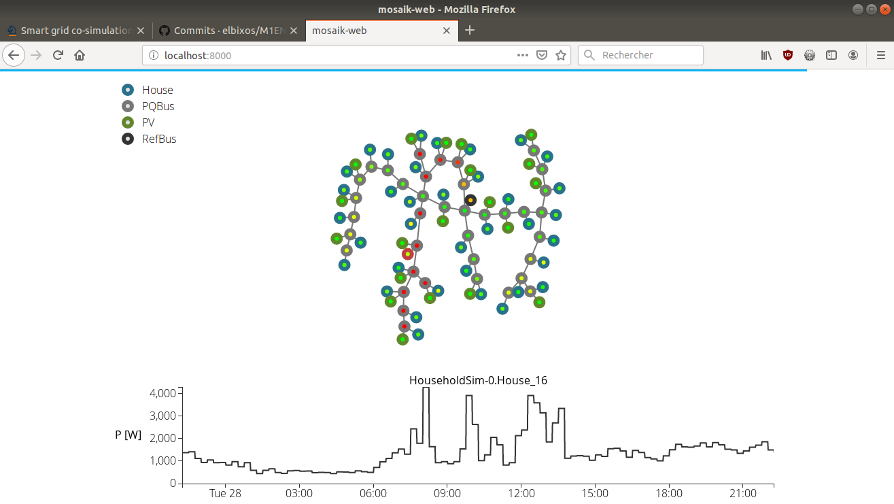

## Smart Grids

### Introduction

Directement repris de *Schvarcbacher, Martin et al (2018). Smart grid testing management platform (SGTMP).
Applied Sciences. 8. 2278.*

In a traditional power distribution grid, electrical power is transmitted
in only one direction: from power plants to transmission lines
and finally, to the energy consumers. This makes it slowto adapt to any
change in the network, since there are only a few sensors at the distribution
points. This can lead to the worst-case failure scenarios which
result in total power loss (a blackout) in the entire grid. Grid operators
have only a limited means to change how the power is distributed [3].
In contrast, a Smart Grid is a new enhanced approach that tries
to solve all of the above problems. The Smart Grid is defined as an
interconnected system of many devices in a power distribution grid.
One of the key components are smart meters deployed at each distribution
endpoint, which allows continuous power usage monitoring and
reporting data back to the grid. Smart meters also allow consumers
to monitor their usage and consequently modify their consumption
based on the current price and conditions. Together all of these devices
allow bidirectional flow of both information and electricity in
the energy grid

In addition, a Smart Grid can be segmented into
multiple micro-grids, where each segment is capable of producing
enough energy for a sustained operation and only taking energy from
the surrounding grids when the demand exceeds the power production
capacity. This allows moving power production closer to the
consumers and promotes renewable energy production

### Installation de mosaik et des simulateurs

#### Creation d'un environnement virtuel

```
python3 -m venv venv
venv\Script\activate
```

#### Installation des packages dans cet environnement

```
pip install mosaik numpy scipy h5py
```

#### Recupération des Sources

```
git clone https://git@bitbucket.org/mosaik/mosaik-demo.git
```

#### Installation des packages supplémentaires
```
cd mosaik-demo/
pip install -r requirements.txt
```

#### lancement de la démo
```
python demo.py
```
Pour visualiser la démonstration, le programme demo.py crée un serveur Web
qui écoute le port 8000 en local. Vous pouvez donc observer la démo en cours
avec votre navigateur à l'adresse [http://localhost:8000/](http://localhost:8000/)

Vous devriez voir quelque chose comme ceci :



### Les TPS

Les énoncés des TP sont accessible ci dessous :
- [../TP/TP1.md](../TP/TP1.md)


___
Vous pouvez repartir vers le [Sommaire](99_sommaire.md)

___
