# Cours Programmation et Objets Connectés

# Auteur : Vincent Pagé : <vincent.page@univ-antilles.fr>


## Introduction

Dans ce cours, nous verrons donc comment aborder la programmation des Objets
Connectés.

Pour la définition, j'ai, sans scrupules, repompé ce qui se dit ici :
[http://www.smartgrids-cre.fr/index.php?p=objets-connectes-definition](http://www.smartgrids-cre.fr/index.php?p=objets-connectes-definition).

Donc, tel quel :

```
Un objet connecté est un objet physique équipé de capteurs ou d’une puce qui
lui permettent de transcender son usage initial pour proposer de nouveaux
services. Il s’agit d’un matériel électronique capable de communiquer avec un
ordinateur, un smartphone ou une tablette via un réseau sans fil (Wi-Fi,
Bluetooth, réseaux de téléphonie mobile, réseau radio à longue portée de type
Sigfox ou LoRa, etc.), qui le relie à Internet ou à un réseau local.

On distingue communément deux grands groupes d’objets connectés :

    - les objets destinés à la collecte et l’analyse de données, dont la
    mission principale est de collecter et transmettre des informations ;

    - les objets qui répondent à une logique de contrôle-commande et
    permettent de déclencher une action à distance.

Les capteurs installés sur ces objets connectés sont plus ou moins
intelligents, selon qu’ils intègrent ou non eux-mêmes des algorithmes
d’analyse de données, et qu’ils soient pour certains auto-adaptatifs.

Sortie en 2003, la lampe DAL connectée en Wi-Fi est le premier objet connecté
de l’histoire. Selon ses créateurs, elle s’est vendue à une cinquantaine
d’exemplaires. Grâce à ses 9 LED, elle pouvait s’allumer de différentes
couleurs en fonction de différents événements liés à la météo, la situation
boursière, la pollution, les alertes Google ou encore des « envois de messages
de couleurs » par SMS ou courriel.
```

Dans la pratique, on voit donc qu'un objet connecté, c'est avant tout :

- un circuit électronique
- dont les actions sont programmables
- qui peut dialoguer sur un réseau (local ou global)

A terme, lors des Travaux Pratiques, nous souhaiterions mettre en place
un équipement dans les salles de TP permettant de contrôler

- la clim
- l'éclairage
- des brasseurs d'air

Tout ceci serait contrôlable depuis un **smartphone**, via un serveur.
Le serveur serait, lui, hébergé sur un **raspberry**.

Si certains de ces mots vous échappent pour le moment, ce n'est pas grave,
on va voir cela calmement.

Mais pour faire tout cela, il va nous falloir quelques notions, et pour
commencer, quelques notions sur les **circuits électroniques programmables**.

___
Vous pouvez repartir vers le [Sommaire](99_sommaire.md)

___
### Introduction aux cartes Arduino

Avant même de faire des objets connectés, il faudrait donc pouvoir programmer
des circuits électroniques. Pour avoir une idée de choses qui nécessitent une des circuits electroniques programmables, considérez un peu :

- la barrière d'entrée de l'université
- un distributeur automatique de boissons.

Ce sont des objets qui ne sont pas forcément connectés, mais dans lequel
on doit effectuer des actions spécifiques lorsque certains évenements se
produisent dans le bon ordre (faire tomber une cochonnerie sucrée lorsque
l'on a mis de l'argent et qu'on a appuyé sur le bon bouton. Accessoirement,
il faut aussi calculer la monnaie à rendre, puis la rendre
(ou blinder la machine contre les coups de genoux)).

Pour faire tout cela, la solution la moins cher consiste
à intégrer dans votre circuit électronique une **carte electronique programmable**. Il en existe énormément de type, de prix très variables.
(ici, je vous mettrais une liste non exhaustive).

Dans le domaine du DIY (Do It Yourself), ce qu'on appelerait sans doute en français le domaine du "je bricole moi même mes trucs de geek", une carte a,
au cours des dernières années, obtenue beaucoup de succès : les cartes
**Arduino**.

#### Les cartes Arduino

Ci dessous, une photo de l'Arduino Uno, très pratique pour les enseignements.
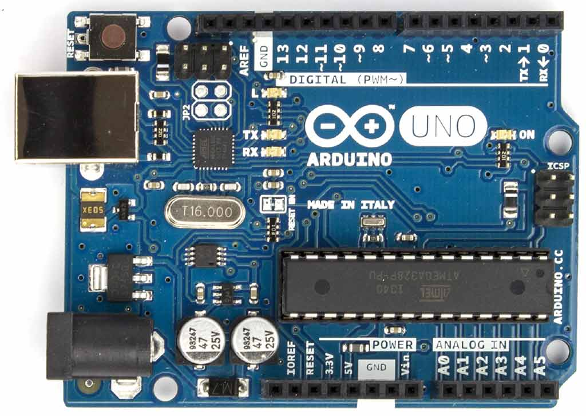

En soi, elle n'ont rien de mieux que les autres, simplements, leurs plans
sont **open source**, copiables, et il existe une documentation très vaste
concernant leur utilisation par des novices.

Cette carte comporte, comme toutes les cartes programmables :

- Un microprocesseur (qui executera le programme)
- une alimentation
- une horloge (qui cadence le programme)
- des broches permettant d'interagir avec le matériel (les boutons, les moteurs, les capteurs ou les lumières)


L'idée est donc de concevoir un programme, qui va prendre en charge
les différents cas qui peuvent se présenter au matériel et déclencher
les évênements voulus.

#### Le logiciel Arduino

Ce programme, dans le cas des cartes Arduino (et très souvent sauf pour
certaines cartes récentes permettant de taper directement le code sur la
carte), est concu sur un ordinateur, pourvu d'un logiciel permettant
de charger ensuite le programme sur la carte.

Lorsque la carte est mise sous tension, ce programme s'éxecute (et on peut
acheter un Mars. Ou un Snickers).

Ce logiciel permettant de préparer son programme et de le charger sur la carte
est également **Open Source** et gratuit dans le cas des cartes Arduino,
ce qui a contribué à leur succès.

Ci dessous, un exemple du logiciel Arduino, permettant de dialoguer avec
l'ensemble des cartes de la famille :
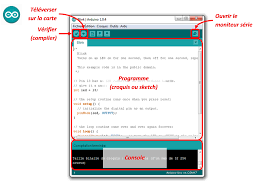

#### Le premier programme

L'équivalent des programmes de type **helloWorld** en électronique
consiste à faire clignoter une diode LED.

Je ne vais pas m'apesantir sur le sujet de la programmation Arduino, car nous
basculeront assez vite sur des Raspberry Pi, mais on retrouve néanmoins de
nombreux points communs entre les programmes sur ces deux types de matériel.

Un programme Arduino est souvent écrit dans un langage proche du **langage C**.
Il comporte deux parties :

- une fonction **setup** qui s'exécute une fois lorsque la carte est mise sous
tension.
- Lorsque le **setup** est terminé, c'est la fonction **loop** qui s'exécute juste en boucle, indéfinimement tant que la carte est sous tension.

Pour faire clignoter une led, il faudrait :

- préparer le circuit electronique (je vais ajouter un schéma un jour)
- brancher ce circuit sur une des broches de la carte (disons la broche 4 par
  exemple)

Le **setup** consisterait a dire : je vais utiliser la broche 4 comme **broche de sortie**

La **loop** pourrait consister a dire :

1. Je met la broche 4 à 5V (a l'état **HAUT**)
2. J'attends un peu (disons une seconde ou 1000 ms)
3. Je met la broche 4 à 0V (a l'état **BAS**)
4. J'attends un peu (disons une seconde ou 1000 ms)

Tout ceci se retrouve dans le programme qui suit :

```c
int brocheLed = 4

// the setup function runs once when you press reset or power the board
void setup() {
  // La broche 4 sera utilisée en SORTIE
  pinMode(brocheLed, OUTPUT);
}

// the loop function runs over and over again forever
void loop() {
  digitalWrite(brocheLed, HIGH);  // Allume la diode
  delay(1000);                    // Attend 1s
  digitalWrite(brocheLed, LOW);   // Eteint la diode
  delay(1000);                    // attend une seconde
}
```
Le programme complet est disponible ici :
[../Sources/Blink.ino](../Sources/Blink.ino)
### Raspberry Pi, premiers pas

Ici, je vais vous présenter les Raspberry,
et toujours faire un premier programme (qui fera aussi clignoter une diode)

#### Présentation des Raspberry Pi

Raspberry Pi est une fondation (originaire du Royaume Uni), qui développe
des ordinateurs tenant sur une seule carte, de taille très réduite.
Du coup, on dit souvent que les Raspberry Pi sont sont des **nano-ordinateurs**.
Du coup, un raspberry pi est avant tout... un ordinateur.

Ci desous, le logo des raspberry pi, une célèbre framboise :

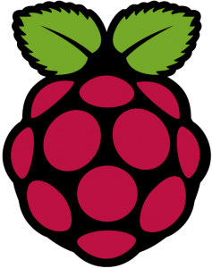

Par rapport a ses grands frères comme les PC, il offre de nombreux avantages
pour travailler avec des objets connectés :
- Ils sont petits.
- Ils sont peu cher.
- Ils consomment très peu d'énergie.
- Ils ont des broches pour interagir avec le matériel (comme les cartes
  Arduino vues précédemment)

En revanche, ils sont relativement peu puissants, ce qui nous empecherait de
faire tourner des gros jeux vidéos dessus. Mais leur puissance est tout à fait
adaptée à de nombreux usages.

Il en existe de nombreuses versions. En TP, nous utiliserons la version *3B*
qui offre l'avantage d'intégrer nativement **le wifi**, **le bluetooth**.
Actuellement, il existe un **raspberry 4**, un peu plus cher et un peu plus
puissant.

Comme tout ordinateur, le raspberry pi a besoin d'un **disque dur**, qui est
dans ce cas une carte **micro SD**.
Le raspberry pi a également besoin d'un système d'exploitation qui est, le plus
souvent, un système **Linux**, dans sa variante **Raspbian**, dérivée de la
distribution Linux **Debian**. Ce système d'exploitation, ainsi que tous les
fichiers que vous pourriez créer ou télécharger seront stockés sur la carte
micro SD.

La version du Raspberry Pi que je vous ai présentée en cours est équipée d'un systeme de
fenêtrage qui permet d'interagir avec lui  avec une souris comme pour tout
ordinateur classique ces jours ci (nous verrons dans un autre cours qu'on peut
s'en passer).

J'ai donc branché sur un **clavier usb**, une **souris usb** et un
**écran HDMI** directement sur le raspberry. L'alimentation est en 5V sur un
port **micro USB**. Dans ce premier cours, nous avons utilisé le powerbank

Lorsque le raspberry pi est configuré pour cela, lorsqu'on le met sous tension,
l'ordinateur **boote**, puis vous propose un écran de connection.
Le login par défaut est **pi**, son mot de passe est **raspberry**.

d'un de vos camarades, vu que j'avais oublié mon alim...
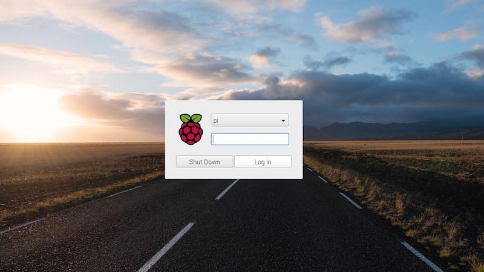

Ceci permet alors d'accéder au bureau, géré par un logiciel nommé **pixel**.

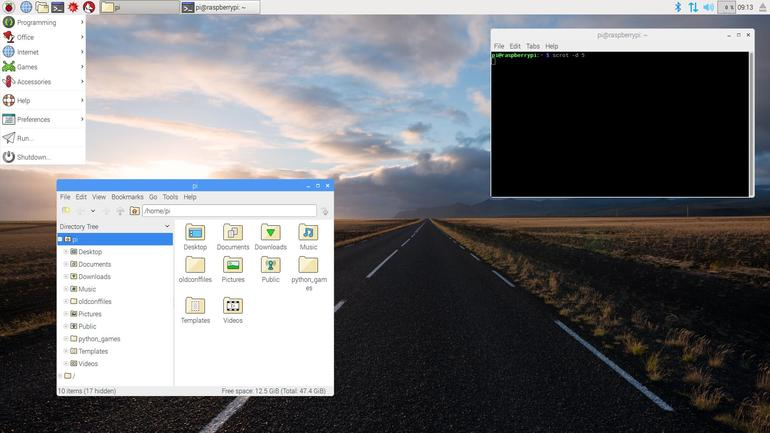

Nous sommes donc en présence d'un véritable ordinateur fonctionnel, permettant
notamment de programmer dans toutes sortes de langages (C, java, python...).

#### Premier programme en Python

Dans notre cas, nous utiliserons Python que nous pouvons lancer pour le moment
avec son environnement de développement.

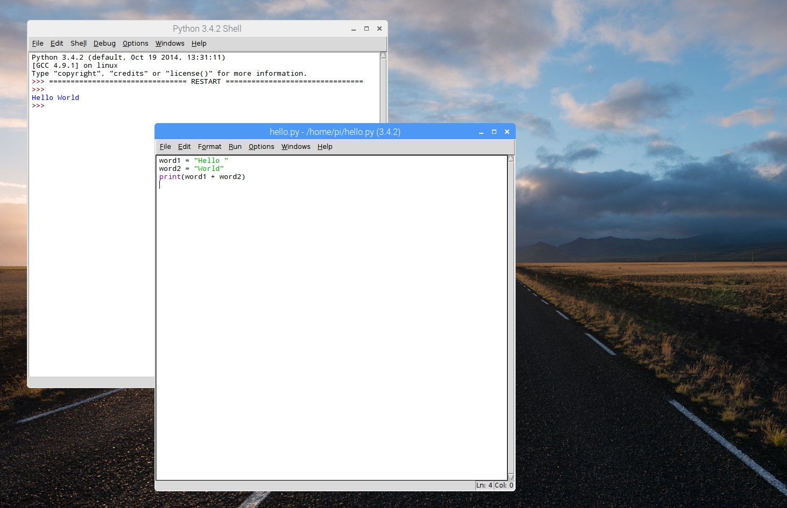

A gauche, la console ou s'éxecute le programme, à droite, le programme python.
(Pour exécuter un programme dans ce contexte, appuyer sur la touche F5)

Comme précédemment, nous souhaitons faire clignoter une LED, branchée
sur une broche du raspberry. Voyons calmement ce programme.

Tout d'abord, il faut choisir une broche sur laquelle brancher la LED.
Pour cela, il faut disposer du plan
des broches (le **pinout**) qui est présenté ci dessous

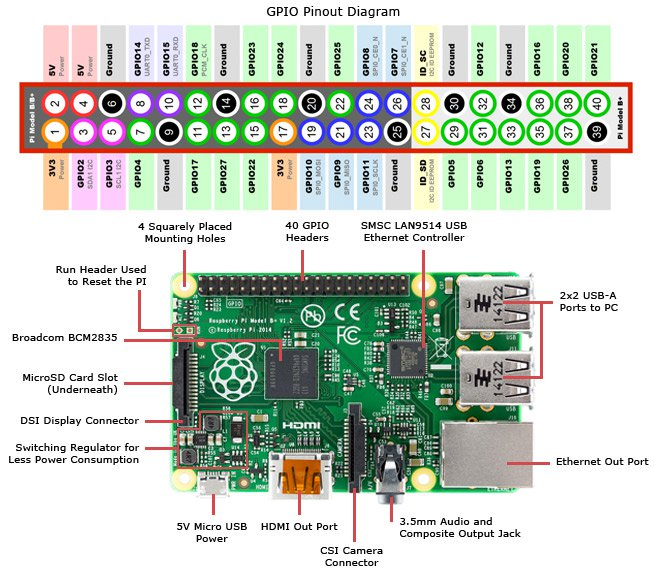

On peut voir que les broches sont numérotées de 1 à 40. Par exemple, les
broches 2 et 4 sont a 5V. Les broches 6 et 9 sont a la masse. La broche 8 est
une broche d'interaction nommée *GPIO14*. **GPIO** est l'acronyme de *General
Purpose Input Output*, ce qui signifie "Broches d'entrées / sorties à usage
général".

Un programme qui veut utiliser une de ces broches devra donc la désigner,
soit par son numéro physique sur la carte (la broche 8), soit par le numéro
qui compose son nom de GPIO (14).

Voici le schéma de montage complet. La masse est prise sur la broche physique 6, la broche physique 8 est utilisée pour l'anode (positif) de la LED.

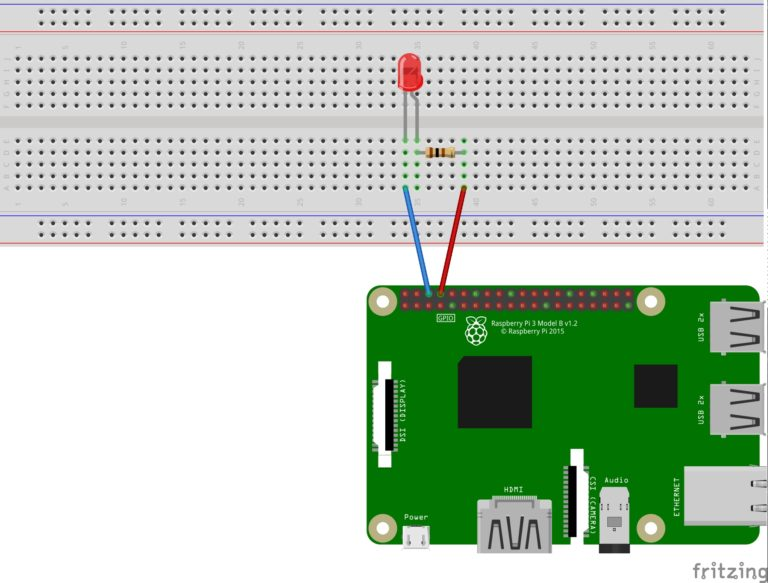

Voyons donc le programme complet, qui suit exactement celui que nous avions
fait pour l'arduino avec quelques petites modifications :

1. On specifie quelle broche est utilisée

2. Puis indéfinimement

  1. On allume la diode
  2. On attend 1s
  3. On eteind la diode
  4. On attend une seconde.


Tout d'abord, il faut dire à python que nous souhaitons utiliser la fonction
*sleep* qui permet de mettre en pause le programme (pour attendre une
seconde). Cette fonction est disponible dans le **module** *time*, que notre
programme doit importer avec la ligne qui suit :

```python
import time
```

A partir de cette ligne, la fonction *sleep* pourrait être appelée
en tapant :
```python
time.sleep(1)
```

Par ailleurs, notre programme doit utiliser les broches.
Pour cela, on **importe le module RPi.GPIO**  qui va nous fournir
les outils pour cela, comme par exemple la fonction *setup* qui permet
de dire qu'une broche va être utilisée en entrée ou en sortie.
On pourait donc importer le module *RPi.GPIO* comme nous l'avons fait pour
le module *time*, mais il faudrait alors apppeler la fonction *setup* comme
suit :
```python
RPi.GPIO.setup(.....)
```
Pour simplifier un peu notre programme, nous allons donc importer le module
*RPi.GPIO* en lui donnant un alias (ici *GPIO*) comme suit.
```python
import RPi.GPIO as GPIO    # Import Raspberry Pi GPIO library
```
Si je veux utiliser la fonction *setup*, je taperais maintenant :
```python
GPIO.setup(.....)
```
Donc pour le moment, nous avons seulement importé nos deux modules
et notre programme ne contient que deux lignes :
```python
import RPi.GPIO as GPIO    # Import Raspberry Pi GPIO library
import time     # Import the time module for the sleep function
```

Ajoutons deux lignes pour lui dire que nous utilisons la broche physique 8,
(aussi appelée GPIO14) comme broche de sortie. On commence par dire au
programme que nous utilisons la numérotation physique des broches (pas son
numéro de GPIO)

```python
GPIO.setmode(GPIO.BOARD)   # Use physical pin numbering
```
Puis on désigne la broche 8 comme broche de sortie :
```python
GPIO.setup(8, GPIO.OUT, initial=GPIO.LOW)
```

Ces deux lignes constituent l'équivalent de ce qui se trouvait dans la fonction *setup* du programme Arduino.

Pour la suite, notre programme doit tourner en boucle indéfiniment,
ce que l'on va faire ici avec une boucle *while*, contenant les 4 étapes
(allume / attend / Eteint / attend)

```python
while True: # Run forever
    GPIO.output(8, GPIO.HIGH) # Turn on
    time.sleep(1)             # Sleep for 1 second
    GPIO.output(8, GPIO.LOW)  # Turn off
    time.sleep(1)             # Sleep for 1 second
```

Le programme complet figure ci dessous.
Il est également téléchargeable dans le répertoire [Sources](../Sources/)
de ce site. Il s'agit du fichier [blinkBoard.py](../Sources/blinkBoard.py).

```python
import RPi.GPIO as GPIO    # Import Raspberry Pi GPIO library
import time     # Import the time module for the sleep function

GPIO.setmode(GPIO.BOARD)   # Use physical pin numbering
GPIO.setup(8, GPIO.OUT, initial=GPIO.LOW)   # Set pin 8 to be an output pin and set initial value to low (off)

while True: # Run forever
    GPIO.output(8, GPIO.HIGH) # Turn on
    time.sleep(1)                  # Sleep for 1 second
    GPIO.output(8, GPIO.LOW)  # Turn off
    time.sleep(1)
```

On peut alors lancer ce programme et constater avec plaisir que notre diode
clignote. Elle ne s'arrêtera jamais. Pour stopper le programme, il faut
demander au système d'exploitation de l'arrêter, ce que l'on ferait en
appuyant sur **CTRL** et **C** simultanément (noté **CTRL C**)

Pour raffiner un petit peu, j'aurais tendance à définir une variable
pour contenir le numéro de la broche de la diode (si je veux modifier,
ce sera plus simple). Mon programme deviendrait :

```python
import RPi.GPIO as GPIO    # Import Raspberry Pi GPIO library
import time     # Import the time module for the sleep function


GPIO.setmode(GPIO.BOARD)   # Use physical pin numbering

ledpin = 8
GPIO.setup(ledpin, GPIO.OUT, initial=GPIO.LOW)   # Set pin 8 to be an output pin and set initial value to low (off)

while True: # Run forever
    GPIO.output(ledpin, GPIO.HIGH) # Turn on
    time.sleep(1)                  # Sleep for 1 second
    GPIO.output(ledpin, GPIO.LOW)  # Turn off
    time.sleep(1)
```

Par ailleurs, j'aurais aussi tendance a définir une variable pour contrôler
la durée totale d'un cycle (ici, 2 secondes) ce qui me permettrait de faire
clignoter ma diode plus ou moins vite. La diode reste allumée la moitié
d'un cycle puis éteinte la moitié d'un cycle. Mon programme deviendrait :

```python
import RPi.GPIO as GPIO    # Import Raspberry Pi GPIO library
import time     # Import the time module for the sleep function


GPIO.setmode(GPIO.BOARD)   # Use physical pin numbering

ledpin = 8
GPIO.setup(ledpin, GPIO.OUT, initial=GPIO.LOW)   # Set pin 8 to be an output pin and set initial value to low (off)

dureeCycle = 2 # En secondes

while True: # Run forever
    GPIO.output(ledpin, GPIO.HIGH) # Turn on
    time.sleep(dureeCycle * 0.5 )                  # Sleep for 1 second
    GPIO.output(ledpin, GPIO.LOW)  # Turn off
    time.sleep(dureeCycle * 0.5)
```

Notons enfin que notre programme utilise la broche 8. En fait, il a demandé
le contrôle de cette broche au Raspberry (qui lui donne de bon coeur).
En revanche, il faudrait que quand le programme s'interromp, il libère toutes
les broches utilisées. Ceci pourrait être fait avec la fonction *GPIO.cleanup()*.

Le problème est qu'il faudrait faire ceci quand notre programme s'arrete, et il ne s'arretera que quand on l'interromppra avec **CTRL C**.
On va donc dire au programme : Tourne indéfiniment, et si une interruption
de type CTRL C arrive, libère les broches.

Le programme complet serait alors, disponible ici : [blinkBoardClean.py](../Sources/blinkBoardClean.py)

```python
import RPi.GPIO as GPIO    # Import Raspberry Pi GPIO library
import time     # Import the time module for the sleep function

GPIO.setmode(GPIO.BOARD)   # Use physical pin numbering

ledpin = 8
GPIO.setup(ledpin, GPIO.OUT, initial=GPIO.LOW)   # Set pin 8 to be an output pin and set initial value to low (off)

dureeCycle = 2 # En secondes
try:    
    while True: # Run forever
        GPIO.output(ledpin, GPIO.HIGH) # Turn on
        time.sleep(dureeCycle * 0.5 )                  # Sleep for 1 second
        GPIO.output(ledpin, GPIO.LOW)  # Turn off
        time.sleep(dureeCycle * 0.5)

except KeyboardInterrupt:  
    GPIO.cleanup()       # clean up GPIO on CTRL+C exit  
```

Et voila !
## Connection au Raspberry en SSH

Pour aller un peu plus loin avec le Raspberry Pi, il va nous falloir
nous intéresser un peu au monde Linux, de façon à interagir avec lui à travers
un terminal (à la fin de ce cours, nous le ferons depuis un autre ordinateur).

Du coup, il me faut vous raconter deux ou trois choses sur Linux / Unix :

### Organisation des fichiers sous Linux

Tout d'abot, il nous faut comprendre comment est organisé l'**arborescence des fichiers** sous Linux.

Dans le monde Linux, tous les fichiers de l'ordinateur sont stockés dans un seul arbre. La **racine** de cette arborescence est notée **/**
Tous les autres fichiers sont quelque part à l'intérieur de cette racine.

A la racine, on trouve des sous répertoires, comme :

- */home/* qui contient les comptes de tous les utilisateurs (sauf un...)
- */etc/* qui contient des fichiers de configuration.
- */bin/* qui contient la plupart des programmes executables.
- ...

Ces répertoires peuvent contenir des sours répertoires et/ou des fichiers.

Enfin, dans chaque répertoire, on trouve deux autres sous répertoires :
- *.* qui désigne le répertoire lui même
- *..* qui désigne le répertoire parent. Par exemple */home/vpage/..**
est en fait */home/*


De plus, Linux permet, depuis toujours, à plusieurs utilisateurs de partager
le même ordinateur.

Chaque utilisateur est caractérisé par son *login* et il se connecte sur la machine par l'intermédiaire de son login et de son *mot de passe*. Chaque utilisateur dispose d'un répertoire personnel, appelé **home directory**,
stocké dans */home/* et qui contiendra tous ses fichiers.

Par exemple, si mon login est *vpage*, mon repertoire personnel sera (le plus
souvent) : */home/vpage*, dans lequel je pourrais créer des sous répertoires
pour ranger mes programmes, mes images...

Enfin, il existe un utilisateur spécial : **root** qui dispose des
droits d'administration (certains utilisateurs auront le droit de passer
momentanément **root** pour effectuer ces actions, nous reviendrons la dessus plus loin). Dans une distribution *Debian* comme celle qui tourne sur nos Raspberry Pi, cet utilisateur ne se connecte jamais directement.

Pour l'utilisation de Linux avec un gestionnaire d'écran, pas besoin de cours,
tout est a peu près intuitif. Vous aurez les mêmes façon d'interagir avec
l'ordinateur qu'avec les autres Systèmes d'exploitation (Windows, Mac Os) et le
même temps d'acclimatation à l'interface.

Néanmoins, il est très fréquent que certaines opérations doivent être faites
en **ligne de commande**, dans un terminal. Voyons donc le minimum vital pour
survivre en ligne de commande.

### La ligne de commande Bash

Quand on se trouve face à un terminal, on voit ce genre de choses :

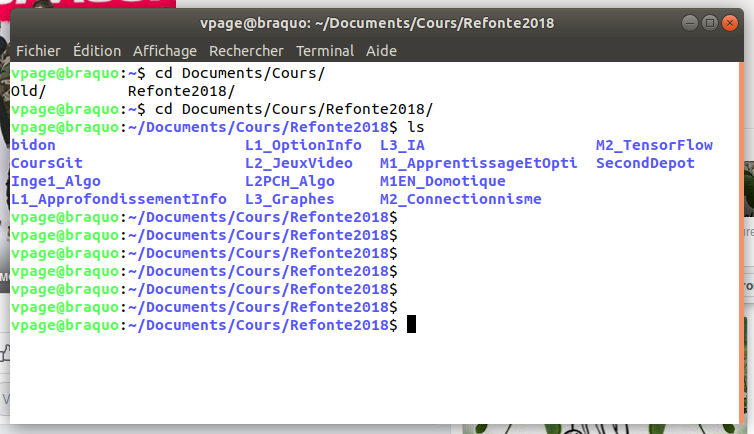

On tape ses commandes sur la ligne qui clignote (le **prompt**).
Ce **prompt** donne en général quelques informations :

1. Dans l'image, l'utilisateur a pour login *vpage*
2. l'ordinateur sur lequel je travaille s'appelle *braquo*
3. je suis actuellement dans le répertoire */home/vpage/Documents/Cours/Refonte2018* . Ce répertoire est appelé **répertoire courant**.

Évidemment, si je me déplace dans l'arborescence, le répertoire
courant change... Le répertoire courant est le répertoire ou je suis
actuellement.

#### Les commandes les plus usuelles

Vite fait, quelques commandes utiles :


- **pwd** (path of working directory) affiche le chemin du répertoire courant)


- **ls** (list) : affiche les répertoires et les fichiers d'un répertoire)
On peut ainsi taper :
  - *ls* : cela liste les fichiers du répertoire courant.
  - *ls /home/vpage/* : cela liste les fichiers du répertoire /home/vpage/

- **cd** (change directory) ; permet de changer de répertoire.
On peut ainsi taper :

  - *cd /home/vpage/Document* pour aller dans le répertoire
  */home/vpage/document*
  - *cd monRepertoire* pour aller dans le sous repertoire *monRepertoire* du
  répertoire courant.
  - *cd ..* (répertoire parent)
  - *cd ~* (home directory)

- **mkdir** (make directory) : créer un répertoire. la commande *mkdir Truc*
va créer un répertoire nommé *Truc* dans le répertoire courant

- **rm** (remove) : effacer des fichiers, des dossiers.
On pourra taper les commandes :
  - *rm toto* : pour effacer le fichier *toto* du répertoire courant.
  - *rm -r monRep* : pour effacer le répertoire *monRep* du répertoire courant.

- **cp** (copy) : fait une copie du fichier. par exemple, *cp toto.txt sauvegarde.txt* fait une copie du fichier *toto.txt* du répertoire courant, et
la sauve sous le nom *sauvegarde.txt*, toujours dans le répertoire courant.

Pour toutes ces opérations, n'oubliez pas, comme vu en cours, qu'il est souvent
inutile de taper le nom complet des commandes, des fichiers ou des répertoires.
La touche < TAB > vous permet de demander la **complétion** des noms, ce qui
permet de gagner beaucoup de temps (et de ne pas faire d'erreurs).

#### Les commandes d'administration

Certaines commandes ne peuvent être executée que par **root**.
C'est par exemple le cas de la commande *raspi-config* qui permet
de modifier des paramètres primordiaux du Raspberry Pi.

Dans les distributions Debian, cela se fait de la façon suivante :
Si vous êtes un utilisateur de type **administrateur**, au lieu
de taper la commande
```
raspi-config
```
vous taperiez
```
sudo raspi-config
```

la commande **sudo** demande ici de lancer la commande *raspi-config* en tant
que **root**.
Le terminal vous demandera d'entrer votre mot de passe pour s'assurer
que c'est bien vous qui faîtes cette demande.


#### Editeurs de texte dans le terminal.

On peut aussi, depuis le terminal, lancer des programmes en les appelant par
leur nom. Dans un contexte de programmation en python, il nous faudra par
exemple lancer

1. un **editeur de texte** pour écrire notre programme (*toto.py*).
2. l’interpréteur python pour exécuter ce programme.

Il en existe de multiples. En voici trois :

- *vi* : très efficace, mais sa prise en main est délicate.
- *emacs* : pas moins efficace, prise en main un peu plus facile.
- *nano* : basique mais facile d'utilisation.

Si vous débutez, je vous conseille *nano* le temps de vous familiariser avec
votre terminal. Vous pourrez toujours vous intéresser à *vi* ou *Emacs* le
jour où vous aurez compris ce que cela apporte (en gros, un gain de temps sur
toutes vos opérations).

Mettons que je sois dans mon **home directory**, et que je veuille y créer un
chemin *M1/Prog/* dans lequel ranger un fichier **blink.py** puis le lancer,
voici la liste des commandes :

```bash
mkdir M1
mkdir M1/Prog
cd M1/Prog
nano blink.py
python blink.py
```

Avec cela, on doit pouvoir survivre pour la suite.
Notre objectif étant de nous connecter à un Raspberry Pi via le réseau
wifi, je vais devoir vous raconter deux ou trois choses sur les réseaux.

### Un peu de réseau.

Comme vous le savez sans doute, les ordinateurs discutent sur le réseau par
l'intermédiaire de **cartes réseaux** qui peuvent être filaire ou wifi.
Chaque carte est identifiée par un numéro, le **numéro IP**.
Mettons que je veuille discuter avec mon Raspberry Pi en wifi, il me faut
connaître le numéro IP de sa carte réseau wifi.

Pour cela, je vais taper dans un terminal du Raspberry Pi la commande
```
ifconfig
```
qui me donnera un résultat tel que le suivant (obtenu non pas sur un raspberry
mais sur mon pc...)

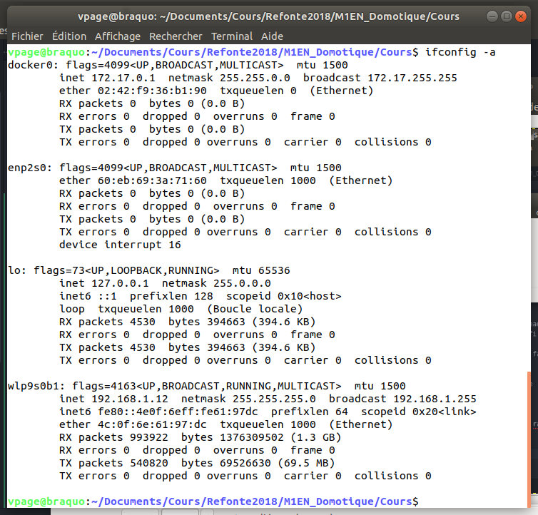

Dans cette réponse, je vois 4 interface réseaux, nommément :
- docker0
- enp2s0
- lo
- wlp9s0b1

celle qui commence par w est la carte wifi.
son numéro IP est **192.168.1.12**

### SSH

Je veux donc me connecter sur le Raspberry Pi depuis un autre ordinateur.
Pour cela, je vais utiliser le protocole **SSH** qui va me permettre
d'obtenir un terminal ouvert sur le Raspberry Pi.

pour utiliser **SSH**, il vous faut 2 choses :
- Un **client ssh** sur mon PC.
- Un **serveur ssh** sur le Raspberry pi (qui va accepter la connection)

Le Raspberry du cours est configuré pour avoir un serveur ssh fonctionnel.
(sinon, cela se fait grâce à la commande *raspi-config*)

Mon Pc linux dispose d'un client ssh. Sur une machine windows, on peut utiliser
par exemple le logiciel *Putty* qui fournit un client.


Mon objectif étant de me connecter, en tant qu'utilisateur *pi* sur le
Raspberry Pi dont j'ai trouvé l'adresse IP tout à l'heure : *192.168.1.12*.
La commande sera :
```bash
ssh pi@192.168.1.12
```

Après avoir entré notre mot de passe, nous disposons d'un terminal,
sur le Raspberry Pi permettant de lancer nos programmes qui font clignoter
nos LED...
## PWM sur un Raspberry Pi

### Raspberry Pi : des broches Numériques.

Au cours du premier cours, nous avions vu comment allumer et éteindre une LED.
Il est temps de clarifier un peu les choses pour aller plus loin et voir
ce qu'il est possible de faire ou pas avec les Raspberry Pi.

Tout d'abord, je vous avais signalé que les broches du Raspberry peuvent
être à l'état HAUT ou Bas. Ce sont des broches **numériques**.

Formalisons un peu cela : le Raspberry est alimenté en 5V.
Ses broches fonctionnent en **3.3 V**. L'état HAUT est donc une tension
de 3.3V, l'état BAS, une tension de 0V.

Qu'est ce que cela implique ?
Il n'y a pas de broche analogique sur un Raspberry Pi.
On peut donc lire ou écrire des
valeurs *0* ou *1*, mais en aucun cas *0.5*.

A vrai dire, si on applique 0.2V sur une broche d'entrée, le Raspberry la lira
comme un état BAS. Si on applique 2.8V, il lira un état HAUT)

De ce fait, il semble impossible d'allumer une lampe avec une intensité
variable sur un Raspberry, la lampe ne pouvant être que Allumée ou Eteinte.

### PWM : principe

Pour y arriver néanmoins, on va utiliser une feinte, dite **PWM** pour *Pulse Width Modulation*.

Lorsque l'on fixe l'état HAUT d'une broche, cela signifie que,
durant un cycle, de durée spécifique, l'état de la broche est HAUT.
Si l'on souhaite envoyer moitié moins de puissance à la broche,
on peut simplement mettre cette broche à l'état HAUT durant la moitié
du cycle.

Si la durée du cycle est très faible, on ne pourra pas voir que la lampe
s'allume puis s’éteint, on ne verra qu'une lampe allumée avec une intensité
plus faible.

Dans le cas d'un moteur, même principe permettrait de faire varier la vitesse
du moteur...

Voici une image représentant ces cycles, empruntée ici [https://www.mbtechworks.com/projects/raspberry-pi-pwm.html](https://www.mbtechworks.com/projects/raspberry-pi-pwm.html)

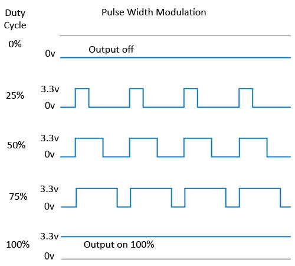

La proportion de temps au cours d'un cycle pendant lequel la broche est
allumée est appelée **Duty Cycle**.


### PWM : programmes Python

#### Premier programme

Commençons par allumer une diode avec une valeur de duty cycle fixée par une
variable. Le programme commence comme précédemment.

```python
import RPi.GPIO as GPIO   # Import the GPIO library.
import time               # Import time library

GPIO.setmode(GPIO.BOARD)  # Set Pi to use pin number when referencing GPIO pins.

ledpin = 8


GPIO.setup(ledpin, GPIO.OUT)  # Set GPIO pin 12 to output mode.
```

Puis, nous demandons un objet PWM pour gérer la broche de la led.
Au passage, nous fixons la fréquence des cycles à 100 Hz (donc la durée d'un
cycle à 0.01s)

```python

freq = 100 # en Hz
pwm = GPIO.PWM(ledpin, freq)   # Initialize PWM on pwmPin 100Hz frequency
```

On fixe ensuite la valeur du duty cycle en fonction des besoins. Cette valeur
peut fluctuer entre 0 (HAUT 0% du cycle) et 100 (HAUT 100% du cycle).

```python
dc = 50
pwm.ChangeDutyCycle(dc)
```

Avec ceci, votre diode s'allume moins fortement qu'avec le programme du cours
précédent.
Le code complet de ce programme est ici :
[../Sources/BlinkPwm01.py](../Sources/BlinkPwm01.py)

En mixant ce principe avec nos compétences de programmation,
nous pouvons faire de nombreuses choses.

#### Demander à l'utilisateur de choisir une intensité

pour cela, il suffit de faire une boucle dans laquelle on demande à
l'utilisateur quelle intensité il souhaite, puis de fixer le duty cycle
à cette valeur. Tant que l'utilisateur n'aura pas entré de nouvelle
valeur, ce duty cycle ne change pas.

```python
while True :
    print ("entrez l'intensité souhaitée")
    dc = int (input() )
    pwm.ChangeDutyCycle(dc)
```

Le code complet de ce programme est ici :
[../Sources/BlinkPwm02.py](../Sources/BlinkPwm02.py)

#### Faire croitre l'intensité d'une led

Encore une fois, c'est relativement simple, il faut une variable qui croit
à chaque tour de boucle, puis on atteint 0.1 seconde avant de changer la valeur
du duty cycle. Si la valeur du Duty cycle passe au dessus de 100, on la
contraint à rester à 100.

```python
dc = 0

while True :
    print ("duty cycle",dc)
    pwm.ChangeDutyCycle(dc)

    dc+= 1

    if dc > 100:
      dc = 100

    time.sleep(0.1)
```

Le code complet de ce programme est ici :
[../Sources/BlinkPwm02.py](../Sources/BlinkPwm03.py)

#### la led qui s'allume et s'eteint progressivement

Même principe mais quand le duty cycle arrive a 100, il faut redescendre.
Quand il arrivera à 0, il faudra remonter.

Nous avons vu en cours que cela nécessitait une nouvelle variable
(ici *step*) qui contienne la direction actuelle (monte ou descend)
lorsqu'on arrive a une limite, on inverse la direction.


```python
dc = 0
step = +1

while True :
    print ("duty cycle",dc)
    pwm.ChangeDutyCycle(dc)
    dc+= step

    if dc >= 100 or dc <= 0:
      step *= -1

    time.sleep(0.1)

```

Le code complet de ce programme est ici :
[../Sources/BlinkPwm02.py](../Sources/BlinkPwm03.py)

C'est tout pour le cours 2.
## Une application Web minimaliste

Pour aller un peu plus loin, nous souhaiterions controler notre
led depuis un ordinateur, ou un téléphone portable, par exemple.

Pour cela, le plus simple est de construire une application Web.

Par exemple, le Raspberry Pi pourrait héberger un **serveur WEB**.
Ce serveur Web proposera des pages permettant de contrôler le matériel.
L'intérêt d'utiliser un serveur Web, est que tous les ordinateurs équipés
d'un **navigateur Web** récent pourront agir sur notre raspberry pi.
C'est nottament le cas de votre smartphone, de votre pc portable (mac, linux, windows) ou de votre tablette...

Voyons donc brièvement ce qu'il nous faut :

### Le serveur web.

Un serveur Web est une application qui écoute le réseau et envoie
des pages HTML à qui les demande.

Quand on tape une **URL** telle que *http://monServeur.gp/toto.html*,
il se passe pas mal de choses, mais pour simplifier :

1. Le réseau trouve l'adresse IP correspondant à l'adresse *monServeur.gp*
2. le navigateur demande au serveur web hébergé à cette adresse le fichier *toto.html*
3. le serveur envoie le code HTML contenu dans cette page
4. Le navigateur affiche ce code HTML

Le serveur le plus utilisé au monde est, sans conteste, **Apache**.
Il est relativement facile d'installer Apache sur un Raspberry.

### Une page HTML de base

Pour écrire des sites Web, on écrit dans un langage, **HTML**,
qui décrit le contenu de la page à afficher.

Voici une page minimaliste
```html
<!DOCTYPE html>
<html>
<head>
    <meta charset="utf-8">
    <title> Une page de test </title>
</head>

<body>
    Je suis une page Web minimaliste.
</body>
</html>
```
La première ligne signale que l'on ce document est écrit en... HTML (5).
Puis, on trouve des **balises**, signalées par des < chevrons >.
Ces balises s'ouvrent et se ferment (avec une balise de même nom
mais commençant par un / ).

La balise < html > signale le début d'une page HTML. Elle est fermée à la fin
du document. Toute la page est contenue entre ces deux balises.

On trouve ensuite 2 balises,
- **head** qui contient des informations sur la page (son titre, son encodage...)
- **body** qui contient ce qui s'affichera réellement dans le navigateur

N'ayant pas pour objectif de vous apprendre a faire des pages Web, mais de vous
fournir les notions minimal pour comprendre et faire des choses, cela nous
suffira pour le moment.

Le code complet est ici : [../Sources/minimal.html](../Sources/minimal.html)

### Ou placer sa page

Une page HTML peut etre ouverte par un navigateur directement comme un fichier.
Néanmoins, ce n'est pas ce que nous voulons le plus souvent. Nous voulons
que ce soit le serveur Web qui l'envoie.
Il faut donc placer cette page parmi les fichiers gérés par le serveur.

Dans notre cas, nous allons placer cette page parmi les pages Utilisateurs
(le module *USER_DIR* d'apache). Ce module permet à tous les utilisateurs
d'une machine de disposer d'un répertoire dans leur **home directory** pour
y placer leurs pages WEB.
Ce répertoire est le répertoire *public_html*. il doit être accessible en
lecture.

Dans notre cas, sur le raspberry, l'utilisateur est *pi*.
Nous avons donc crée un repertoire */home/pi/public_html* dans lequel
nous placerons tous nos fichiers (comme *minimal.html*)

Ce fichier est accessible par l'URL suivante :
 *http://IPduRaspberryPi/~pi/minimal.html*

### Une page HTML programmée

Le problème est que nous voulons faire un programme pour interagir avec
le Raspberry Pi. Nous pages ne doivent pas se contenter d'afficher des choses,
elles doivent pouvoir déclencher des actions paramétrables.

Pour cela, nous allons utiliser des pages **PHP**. PHP est un langage de programmation qui nous servira surtout a lancer d'autres programmes, donc
nous ne verrons encore une fois que peu de choses à son propos.

Reprenons l'exemple d'une **requête** du navigateur, mais portant sur une page
php cette fois :

Quand on tape une **URL** telle que *http://monServeur.gp/toto.php*,
il se passe encore plus de choses :

1. Le réseau trouve l'adresse IP correspondant à l'adresse *monServeur.gp*
2. le navigateur demande au serveur web hébergé à cette adresse le fichier *toto.php*
3. Le serveur exécute le code contenu dans le fichier *toto.php*
4. l'execution de ce code génère du code HTML
5. le serveur envoie le code HTML généré
6. Le navigateur affiche ce code HTML

Dans la version proposée ici, le fichier PHP contiendra le même code
HTML que précédemment.
Lorsque certaines opérations doivent être calculées, on bascule
en php avec la balise
```
<?php>
```
qui se ferme avec le code

```
?>
```

Voyons donc le contenu de cette page :
```html
<!DOCTYPE html>
<html>
<head>
    <meta charset="utf-8">
    <title> Une page de test </title>
</head>

<body>
    Je suis une page Web minimaliste.
    <?php
    echo "Avec un programme qui s'execute sur le SERVEUR";

    $var1 = 12;
    $var2 = 6;

    echo $var1+$var2;
    ?>
</body>
```

Ce code doit être clair si l'on sait que :
- les variables commencent par un signe $ en php.
- *echo* est l'équivalent en PHP de *print* en python

Le code complet est ici : [../Sources/minimal.php](../Sources/minimal.php)

Encore une fois, on place ce fichier dans */home/pi/public_html*
et ce fichier est accessible par l'URL suivante :
 *http://IPduRaspberryPi/~pi/minimal.php*

**ATTENTION** : sur le Raspberry Pi, il faut veiller à avoir :

1. installé le module PHP pour apache
2. autorisé les USER DIR a utiliser php

### Lancement d'un programme Python par le serveur web

Notre serveur web peut executer des commandes, par l'intermédiaire
de PHP. Nous pourrions donc directement interagir avec les broches du
Raspberry Pi en PHP.
Mais je considère que Python vous sera plus utile et nous savons
déja faire des choses en Python, donc nous pouvons reformuler :

Nous voudrions donc un faire un programme en PHP qui lance, sur le serveur,
un programme Python (qui va gérer la LED)

Imaginons ce programme Python :
```python
print ("Je suis le programme python")

print ("je calcule un truc...")
a = 5
b = 8

print (a+b)
```

Le code complet est ici : [../Sources/test.py](../Sources/test.py)

Il est possible de le lancer depuis PHP, avec ce code :

```html
<!DOCTYPE html>
<html>
<head>
    <meta charset="utf-8">
    <title> Une page de test </title>
</head>

<body>
<?php

echo "<p>Je suis le script php. j'appelle un script
python et voici ce que celui écrit : </p>";

echo "<hr>";

$command = escapeshellcmd('python3 test.py');
$output = shell_exec($command);
echo "<p>";
echo $output;
echo "</p>";
?>
</body>
</html>
```
Le code complet est ici : [../Sources/phpLaunchPython.php](../Sources/phpLaunchPython.php)

Encore une fois, on place ce fichier dans */home/pi/public_html*
et ce fichier est accessible par l'URL suivante :
 *http://IPduRaspberryPi/~pi/phpLaunchPython.php*
## Application à la gestion des LED

### Allumage d'une Led pendant 1s

En remplacant le programme *test.py* par un programme qui allume une led
pendant une seconde, nous devrions avoir notre première gestion de matériel
depuis un site web.

Voici un programme python qui allume une LED pendant une seconde :
```python
import RPi.GPIO as GPIO    # Import Raspberry Pi GPIO library
import time     # Import the time module for the sleep function

GPIO.setmode(GPIO.BOARD)   # Use physical pin numbering
GPIO.setup(8, GPIO.OUT, initial=GPIO.LOW)   # Set pin 8 to be an output pin and set initial value to low (off)

GPIO.output(8, GPIO.HIGH) # Turn on
time.sleep(1)                  # Sleep for 1 second

GPIO.output(8, GPIO.LOW)  # Turn off

GPIO.cleanup()       # clean up GPIO on CTRL+C exit
```

Le code complet est ici : [../Sources/turnOn1s.py](../Sources/turnOn1s.py).

On appelle ce programme depuis une page php dont voici le code :

```html
<!DOCTYPE html>
<html>
<head>
    <meta charset="utf-8">
    <title> Une page de test </title>
</head>

<body>
<?php

echo "<p>Je suis le script php. j'appelle un script
python et voici ce que celui écrit : </p>";

echo "<hr>";

$command = escapeshellcmd('python3 turnOn1s.py');
$output = shell_exec($command);
echo "<p>";
echo $output;
echo "</p>";
?>
</body>
```

Le code complet est ici : [../Sources/startLed.php](../Sources/startLed.php)

Encore une fois, on place ce fichier dans */home/pi/public_html*
et ce fichier est accessible par l'URL suivante :
 *http://IPduRaspberryPi/~pi/StartLed.php*

 Et cela doit allumer la LED !
 **Mais en fait non...**


 ### Quelques problèmes rencontrés.
En fait, nous avons eu plusieurs problèmes à régler.

#### Problèmes de permissions


Quand un navigateur demande une page *PHP* au serveur web du Raspberry Pi,
c'est bien le serveur (apache) qui exécute le code PHP sur le Raspberry Pi.
Dans le monde Linux, ce serveur est un utilisateur spécifique.
Dans le cas de la Raspbian, cet utilisateur s'appelle *www-data*.
Cet utilisateur a le droit de faire des choses, mais pas d'autres.

##### Droits d'accès aux fichiers php et python

Par exemple, le serveur ne peut pas fouiller dans tous les fichiers sauf si vous
lui donnez explicitement l'autorisation de le faire).

Notez que le code du programme *startLed.php* a été crée par un autre utilisateur
(*pi*) et est stocké dans le répertoire de celui ci.
il faut donc s'assurer que
1. *www-data* a le droit de traverser le répertoire */home/pi* (pour accéder
  à */home/pi/public_html*)
2. *www-data* a le droit de traverser *~/public_html* pour accéder au fichier *startLed.php*
3. *www-data* a le droit de lire le fichier *startLed.php*
4. *www-data* a le droit de lire le fichier *turnOn1s.py*

il suffit de lancer la commande
```
ls -alh ~/public_html
```

Vous devriez voir quelque chose comme ceci
(je dois ajouter l'image, je n'ai pas mon pc avec moi)
dans lequel on peut observer :


1. que tous les utilisateurs peuvent traverser */home/pi* (c'est le répertoire *..*)
2. que tous les utilisateurs peuvent traverse *~/public_html*
(c'est le répertoire *.*)
3. que tous les utilisateurs peuvent lire le fichier *startLed.php*
4. que tous les utilisateurs peuvent lire le fichier *turnOn1s.py*

Dans le cas du cours, ceci n'était pas le problème.

##### Droits d'accès aux GPIO

Par défaut, tous les utilisateurs n'ont pas le droit d'accès aux GPIO
(les broches du Raspberry). Il faut donc autoriser l'utilisateur *www-data*
à pouvoir manipuler ces broches.

Pour cela, linux utilise la notion de **groupes d'utilisateurs**.
Le groupe *gpio* à le droit d'utiliser les GPIO.
Il nous faut donc intégrer *www-data* au groupe *gpio*.
Ceci se fait avec cette commande.

```
sudo usermod -a -G gpio www-data
```

on peut vérifier les groupes de l'utilisateurs *www-data* en tapant
```
groups www-data
```

Enfin, il peut falloir redémarrer le serveur apache.
```
sudo /etc/init.d/apache2 restart
```

##### Des problèmes d'accents

Pour une raison pas très claire, il est apparu que le python, lancé par
*www-data* avait des soucis avec les accents dans le code (même dans les
  commentaires)
En première solution, j'ai supprimé les accents dans le code

### Rendons cela plus propre.

 Pour une application de domotique, il faudra sans doute des boutons
 de réglages, puis un bouton sur lequel cliquer pour envoyer les commandes.
 Tout ceci est fait en **HTML** avec des formulaires.

 Notre premier formulaire ne comportera qu'un bouton permettant
 de lancer la commande.

on ajouterait dans une page HTML les lignes suivantes
```html
<form action="traitement.php" method="post">
  <button type="submit">Envoyer le message</button>
</form>
```
Ceci crée un formulaire qui va appeler le fichier *traitement.php*
lorsque l'on clique sur le bouton.
Comme lorsque l'on clique, je veux en fait appeler le fichier PHP
qui lance le programme python qui allume la led, je modifie un peu
ce code en

```html
<form action="startLed.php" method="post">
  <button type="submit">Envoyer le message</button>
</form>
```

Voici le code complet de la page
[../Sources/startForm.php](../Sources/startForm.php)

```html
<!DOCTYPE html>
<html>
<head>
    <meta charset="utf-8">
    <title> Une page de test </title>
</head>

<body>
  <form action="startLed.php" method="post">
    <button type="submit" id="submit" name="submit">Envoyer le message</button>
  </form>
</body>
</html>
```

### Rendons cela plus encore propre.

c'est un peu dommage que lorsque l'on clique sur le bouton,
on parte sur une nouvelle page.
Nous allons donc modifier un peu le code pour rester
toujours sur la même page.
Notre formulaire va tenir dans la page *startForm2.php*
et son traitement sera fait aussi par le fichier *startForm2.php*.
Pour cela, on modifie un peu le code précédent
```html
  <form action="startForm2.php" method="post">
```

Puis, il faut distinguer deux cas :
1. l'utilisateur arrive sur la page sans cliquer
(on lui afficher juste le formulaire)
2. l'utilisateur arrive sur la page parcequ'il a cliqué : on lui affiche le formulaire ET on allume la LED.

Pour faire cela, il vous faut quelques explications sur $ \_\_POST $.
Cette variable contient les données envoyée par le formulaire.
Ce formulaire ne contient qu'une donnée, associée au bouton *submit*.
La donnée associée au bouton submit est contenue dans *$\_POST["submit"]*

- Si on arrive sur la page sans cliquer, cette variable est non définie.
- Si on arrive sur la page en ayant cliqué, cette variable est la chaine de
caractères vide.

On peut donc écrire facilement le code suivant :
```html
<!DOCTYPE html>
<html>
<head>
    <meta charset="utf-8">
    <title> Une page de test </title>
</head>

<body>
  <form action="startForm2.php" method="post">
    <button type="submit" id="submit" name="submit">Allumer</button>
  </form>

  <?php
  if (isset($_POST["submit"])){
      $command = escapeshellcmd('python3 turnOn1s.py');
      $output = shell_exec($command);
  }
  ?>
</body>
</html>
```

Voici le code complet de la page
[../Sources/startForm2.php](../Sources/startForm2.php)
## Amélioration de la gestion des LED

### Introduction

Ici, nous voulons que l'on puisse, par exemple,
faire clignoter une diode avec une fréquence définie.

Le problème est le suivant :
Nos programmes précédents allumaient la diode une seconde
puis s’arrêtaient.

Ici, le programme python qui pilote la diode doit :
- tourner en permanence (et faire clignoter)
- écouter le serveur web à l'écoute d'une nouvelle consigne.

Notre programme python va donc se comporter comme un **serveur**
(un logiciel qui tourne en permanence). Ce serveur sera le programme *serverLed.py*

Il faudra que le serveur web **contacte** le serveur
en tant que **client** pour envoyer ses consignes.

Pour rester le plus possible en Python, le nouveau mécanisme va
être le suivant :
quand on clique sur le bouton :
1. on appelle le formulaire *useLed.php*.
2. celui ci lance un programme python : *clientLed.py*
3. *clientLed.py* contacte *serverLed.py* pour lui donner ses consignes
4. *serverLed.py* actualise le comportement de la LED.

De fait, le programme *useLed.php* pourrait directement contacter
le programme *serverLed.py* mais j'ai souhaité que PHP ne fasse
que lancer du python.

Ceci nécessite deux ou trois nouvelles petites choses,
telles que des **sockets** et des **threads**...
Mais avant cela, préparons le fichier Php

### Code PHP

Reprenons le code précédent vu auparavant, que l'on adapte
puisque son nom est *useLed.php* et qu'il appelle le fichier
python *clientLed.py*. J'ai également ajouté un titre de niveau 1
dans la page page (Gestion de Led)

```html
<!DOCTYPE html>
<html>
<head>
    <meta charset="utf-8">
    <title> Une page de test </title>
</head>

<body>
  <h1> Gestion de LED </h1>
  <form action="useLed.php" method="post">
    <button type="submit" id="submit" name="submit">Allumer</button>
  </form>

  <?php
  if (isset($_POST["submit"])){
      $command = escapeshellcmd('python3 clientLed.py');
      $output = shell_exec($command);

      echo "<p>";
      echo $output;
      echo </p>
  }
  ?>
</body>
</html>
```

Ajoutons dans le formulaire un champ pour la fréquence :

- On ajoute un paragraphe pour bien séparer les champs. Ceci grâce à la balise \<p\>,
- on ajoute un label pour écrire "Fréquence" devant le champ.
- on ajoute le champ *freq* pour que l'utilisateur puisse entrer
un nombre.

Voici le code du formulaire, qui remplace l'ancien :

```html
<form action="useLed.php" method="post">

  <p>
    <label for="freq">Fréquence</label>
    <input type="number" name="freq" id="freq" />
 </p>
   <button type="submit" id="submit" name="submit">Clignoter</button>

</form>

```

On vérifie que l'affichage fonctionne :

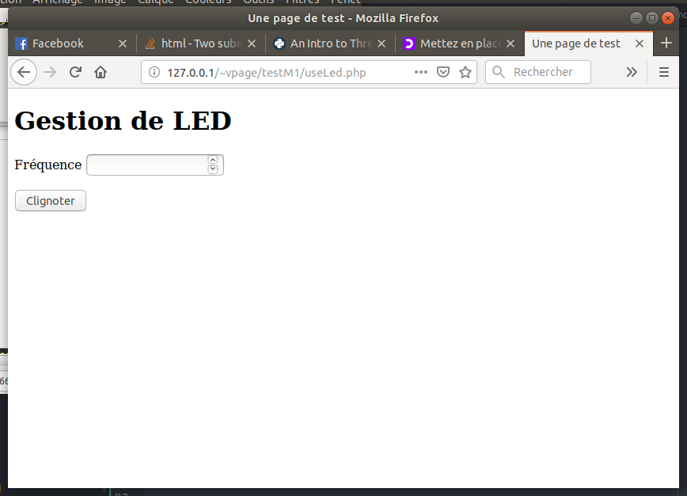


Ajoutons que le script Php doit récupérer la valeur de la fréquence
qu'il recoit du formulaire, et la transmettre au programme python qu'il lance.

Pour récuperer cette valeur, on regarde dans *\$_POST*
```
$frequence = $_POST["submit"]
```

Pour transmettre cela au programme python qu'on lance,
il faut que la commande devienne :
```
python3 clientLed.py $frequence
```

je vais changer les simples guillemets du programme précédent
par des doubles, ce qui va permettre a PHP de remplacer *\$frequence*
par sa valeur
```
<?php

if (isset($_POST["submit"])){
    $frequence = $_POST["submit"];

    $command = escapeshellcmd("python3 clientLed.py $frequence");
    $output = shell_exec($command);
```

Pour vérifier, on va faire un programme python *clientLed.py* tout bête qui
affiche la valeur du paramètre avec lequel il est lancé.

```python
import sys

freq = sys.argv[1]
print ("Je suis python, vous voulez une fréquence de :", freq)
```

Ceci nous permettra d'avoir ce type de choses :

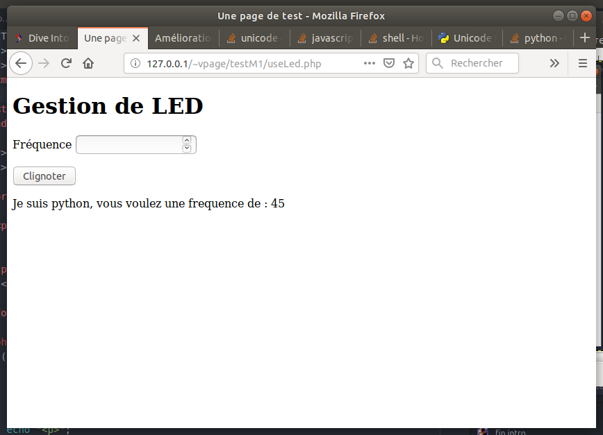
### Un peu de style.

Rendons ceci plus joli : on va utiliser les Feuilles de styles (CSS) pour
améliorer visuellement notre formulaire.
C'est une bonne habitude de mettre les instructions de style dans
un fichier séparé du code HTML. Ce fichier s'appellera ici *styleM1.css*

Commencons par dire, dans le fichier PHP, que le navigateur doit récuperer
ce fichier pour la mise en page. Ceci se fait dans la balise *head*,
en ajoutant la ligne suivante :

```html
 <link rel="stylesheet" href="styleM1.css" />
```

Je n'ai pas l'intention ici de faire un cours complet sur les CSS (c'est long),
juste de vous en apprendre quelques notions.
Dans un fichier css, on veut définir des **instructions de style** appliquer à certains **éléments** de la page HTML.

Les éléments sont choisis avec un **sélecteur**, comme par exemple le nom d'une
balise. Puis on définit la **valeur** d'une **propriété** pour ce sélécteur.

Par exemple : Si je veux mettre un fond noir sur toute ma page,
je dois selectionner la balise *body*, et donner à la propriété
*background-color* la valeur *black* (ou *#000000*).
Dans mon CSS, j'écrirais :
```css
body
{
    background-color: black;  /* Le fond de la page sera noir */
}
```
En bricolant un peu (et en repompant des styles sur le net), on arrive à ceci :

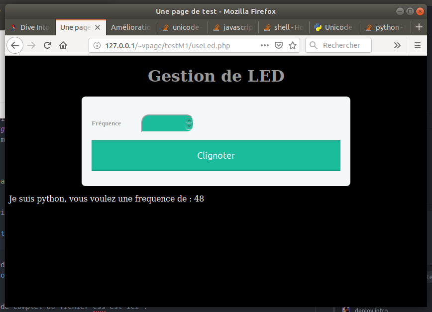


Le code complet du fichier PHP est ici : [../Sources/useLed.php](../Sources/useLed.php)


Le code complet du fichier css est ici : [../Sources/styleM1.css](../Sources/styleM1.css)
### Clignotement.

Oublions un instant le serveur web et  voyons comment faire clignoter proprement.
Comme je n'ai pas de Raspberry sous la main, je vais simuler avec un
programme qui affiche des choses.

L'idée du clignotement est la suivante :

```python
import time

clignote = True
while clignote:
  print ("allume")
  time.sleep(1)
  print ("eteint")
  time.sleep(1)
```

Si l'on veut prendre en compte une valeur passée
de fréquence, cela deviendrait :

```python
import time

freq = 1 # en Hz
t = 1/freq

clignote = True

while clignote:
  print ("allume")
  time.sleep(t/2)
  print ("eteint")
  time.sleep(t/2)
```

Disons que l'on veuille changer la fréquence quand l'utilisateur
tape une nouvelle valeur au clavier...
cette partie du code serait :

```python
print("Entrez la fréquence")
freq = float(input());
```

Le problème est que je ne peux pas intégrer ces lignes dans la boucle :
l'attente de l'utilisateur bloque le clignotement.
Inversement, les *sleep* du clignotement pourraient empécher la réception des
arrivées de demande de changement de fréquence (pas dans le cas du clavier,
mais si cela venait du réseau, oui)

Le code qui suit **ne permet donc pas** de clignoter :
```python
import time

freq = 1 # en Hz
t = 1/freq

clignote = True

while clignote:
  print ("allume")
  time.sleep(t/2)
  print ("eteint")
  time.sleep(t/2)

  print("Entrez la fréquence")
  freq = float(input());
```

Notre programme doit donc avoir deux parties :
- une qui clignote
- une qui attend.

Pour cela, nous allons utiliser des **Threads**

### Les Threads

Bon, on va dire que ce sont presque des processus qui s'exécutent
parallèlement dans un programme.

Commencons par créer une fonction qui clignote.
Cette fonction utilise les **variables globales** suivantes :
- clignote (boolean)
- freq (un float)

```python
def clignoter():
  while clignote:
      t = 1/freq
      print ("allume")
      time.sleep(t/2)
      print ("eteint")
      time.sleep(t/2)
```

Mon programme principal va alors créer un thread
qui exécute cette fonction *clignoter*.
Le programme principal reste donc libre de faire autre chose...

On définit le thread à créer comme suit :
```python
monThread = threading.Thread(target=clignoter)
```
On le lance comme cela.
```python
monThread.start()
```

Voici donc un premier programme complet,
qui clignote, tout en affichant d'autres choses.

```python
# -*- coding: utf-8 -*-
import time
import threading

def clignoter():
  while clignote:
      t = 1/freq
      print ("allume")
      time.sleep(t/2)
      print ("eteint")
      time.sleep(t/2)


freq = 0.5 # en Hz
clignote = True

monThread = threading.Thread(target=clignoter)
monThread.start()

while True:
     print("pg principal")
     time.sleep(2)
```

Ne lancez pas ce programme, vous auriez du mal a arrêter le thread...
Ajoutons donc quelques lignes pour que tout s'arrête proprement si on appuie
sur CTRL + C... Il suffit que si le programme principal s'arrête, la variable
*clignote* passe à *False*. Ainsi, la boucle du thread s’arrêtera et le thread
se terminera avec la fonction *clignoter*.

Voici le code du programme principal seul :

```python
freq = 0.5 # en Hz
clignote = True

try:

    monThread = threading.Thread(target=clignoter)
    monThread.start()

    while True:
        print("pg principal")
        time.sleep(2)

except (KeyboardInterrupt, SystemExit):
    clignote = False
```

Il ne reste plus qu'a prendre en compte les choix de l'utilisateur,
c'est facile. Voici le code du programme complet :
```python
# -*- coding: utf-8 -*-
import time
import threading

def clignoter():
  while clignote:
      t = 1/freq
      print ("allume")
      time.sleep(t/2)
      print ("eteint")
      time.sleep(t/2)

  print("j'arrete de clignoter")

freq = 0.5 # en Hz
clignote = True

try:

    monThread = threading.Thread(target=clignoter)
    monThread.start()

    while True:
         print("pg principal")
         print ("entrez la frequence souhaitee")
         freq = float(input())

except (KeyboardInterrupt, SystemExit):
    clignote = False
    print ("je sors du programme principal")
```

### Modification pour intégrer les Leds

On transforme ceci un petit peu...
Il suffit d'injecter le code de cligntement des leds dans notre fonction.
On pourrait faire ceci :
```python
def clignoter():
  broche = 8
  GPIO.setmode(GPIO.BOARD)  
  GPIO.setup(broche, GPIO.OUT, initial=GPIO.LOW)

  while clignote:
      t = 1/freq

      GPIO.output(broche, GPIO.HIGH) # Turn on
      time.sleep(t/2)

      GPIO.output(broche, GPIO.LOW)  # Turn off
      time.sleep(t/2)

  print("j'arrete de clignoter")
```

Une remarque néanmoins :
Je souhaite que le numéro de broche soit choisi par le programme principal
(car potentiellement, je voudrais en faire clignoter plusieurs en meme temps).

C'est aussi le programme principal qui définira que cette broche est une broche
de sortie.

Je pourrais faire de broche une variable globale mais c'est moche
(et rendrait difficile d'en faire clignoter plusieurs en meme temps)

Je vais donc passer ce numéro de broche à ma fonction clignoter, qui devient :

```python
def clignoter(broche):
  GPIO.setmode(GPIO.BOARD)  
  GPIO.setup(broche, GPIO.OUT, initial=GPIO.LOW)

  while clignote:
      t = 1/freq

      GPIO.output(broche, GPIO.HIGH) # Turn on
      time.sleep(t/2)

      GPIO.output(broche, GPIO.LOW)  # Turn off
      time.sleep(t/2)

  print("j'arrete de clignoter")
```

Il s'agit maintenant, pour le programme principal, de creer un thread
qui execute la fonction *clignoter* en lui passant le numéro de broche
comme argument.
Dans mon programme principal, je vais donc trouver ceci :

```python
ledpin = 8
GPIO.setmode(GPIO.BOARD)                        # Use physical pin numbering
GPIO.setup(ledpin, GPIO.OUT, initial=GPIO.LOW)

try:

    monThread = threading.Thread(target=clignoter, args=(ledpin,))
    monThread.start()
```

Au final, voici le code complet :

```python
# -*- coding: utf-8 -*-
import time
import threading
import RPi.GPIO as GPIO    # Import Raspberry Pi GPIO library


def clignoter(broche):

  while clignote:
      t = 1/freq

      GPIO.output(broche, GPIO.HIGH) # Turn on
      time.sleep(t/2)

      GPIO.output(broche, GPIO.LOW)  # Turn off
      time.sleep(t/2)

  print("j'arrete de clignoter")

freq = 0.5 # en Hz
clignote = True

ledpin = 8
GPIO.setmode(GPIO.BOARD)                        # Use physical pin numbering
GPIO.setup(ledpin, GPIO.OUT, initial=GPIO.LOW)

try:

    monThread = threading.Thread(target=clignoter, args=(ledpin,))
    monThread.start()

    while True:
         print("pg principal")
         print ("entrez la frequence souhaitee")
         freq = float(input())

except (KeyboardInterrupt, SystemExit):
    clignote = False
```

Le code complet du fichier PHP est ici : [../Sources/blinkLedThread.py](../Sources/blinkLedThread.py)

## Les Sockets

### Principes : IP et ports

Ce que nous avons fait auparavant est une partie du programme
*serverLed.py* qui gère la led.
Il s'agit maintenant pour un autre programme (*clientLed.py*) de signaler
au programme *serverLed* qu'il faut qu'il change la fréquence.

Pour établir une communication entre deux programmes, nous pouvons utiliser
les **sockets** qui sont un moyen assez général de communiquer pour deux programmes, le plus souvent à travers le réseau.

Un programme qui tourne sur une machine, peut écouter les requêtes du réseau
en utilisant une interface réseau de cette machine (une carte réseau).
Comme plusieurs applications peuvent avoir besoin du réseau en même temps,
les communications seront associées à un numéro de port permettant de les trier.

Ainsi, la destination d'une communication est caractérisée par deux nombres :
- Le numéro IP de la machine hote (d'une de ses interfaces réseau)
- Le numéro de port associé à l'application.

Un certain nombre de numéro de ports ont une application associée par défaut.
Par exemple, si je contacte :
- la machine 192.168.1.17 sur le port 80, c'est son serveur web qui répondra (sans doute)
- la machine 192.168.1.17 sur le port 22, c'est son serveur ssh qui répondra (sans doute)
- la machine 192.168.1.17 sur le port 443, c'est son serveur web qui répondra en connexion sécurisée, https. (sans doute)

Le numéro de port est compris entre 0 et 65535 (il y en a donc un certain nombre !) et les numéros entre 0 et 1023 sont réservés par le système. On peut les utiliser, mais ce n'est pas une très bonne idée.

### premier serveur

Notre programme *serverLed.py* doit donc réquisitionner un port réseau
de la machine sur laquelle il tourne. J'ai choisi le port 10000.

Notre programme *serverLed.py* devra donc faire les choses suivantes.

Pour importer les modules utiles :

```python
import socket
import sys
```

Pour créer un objet *sock* gérant les connections
```python
# Create a TCP/IP socket
sock = socket.socket(socket.AF_INET, socket.SOCK_STREAM)
```

Pour attacher cette socket à un port :
```python
# Bind the socket to the port
server_address = ('', 10000)
print ('je démarre sur : ',server_address)
sock.bind(server_address)
```

Puis on dit au serveur de commencer à écouter (une seule connection
pour simplifier) :
```python
# Listen for incoming connections
sock.listen(1)
print ("waiting")
```

On va le mettre en attente d'une connection, ce qui va bloquer
le programme jusqu'à ce que quelqu'un se connecte :
```python
print 'waiting for a connection')
connection, client_address = sock.accept()
```

Si l'on passe cette ligne, on dispose d'une *connection* vers le client,
dont l'adresse est indiquée dans *client_adress*
Cette connection va nous permettre d'envoyer (*send*) et de recevoir (*recv*)
des informations.

Dans notre cas, pour simplifier, on va recevoir un paquet de données en provenance du client (de longueur max 256), transformée en chaine de charactere
de type utf8...

```python
data = connection.recv(256).decode("Utf8")
print ('received ', data)
```

Enfin, on pourra fermer la connection :
```
connection.close()
```

Voici donc le code de notre premier serveur :

```python
import socket
import sys

# Create a TCP/IP socket
sock = socket.socket(socket.AF_INET, socket.SOCK_STREAM)

# Bind the socket to the port
server_address = ('', 10000)
print ('starting up on',server_address)
sock.bind(server_address)

# Listen for incoming connections
sock.listen(1)
print ("waiting")

print ('waiting for a connection')
connection, client_address = sock.accept()

print ('connection from', client_address)

data = connection.recv(256)
print ('received ',data)

connection.close()
```

Le code complet du serveur python est ici : [../Sources/server1.py](../Sources/server1.py)

### premier client

Le client doit lui aussi créer une socket,
```python
import socket
import sys

# Create a TCP/IP socket
sock = socket.socket(socket.AF_INET, socket.SOCK_STREAM)
```

Puis, il connecte sa socket au serveur
```python
# Connect the socket to the port where the server is listening
server_address = ('localhost', 10000)
print ('connecting to', server_address)
sock.connect(server_address)
```

Puis il peut envoyer des informations au serveur (ou en recevoir)
```python
message = 'hey, je parle dans une socket.'
print ('sending ' message)
sock.sendall(message)
```

Enfin, quand il a fini, il ferme la connection
```python
print ('closing socket')
sock.close()
```

Soit le programme complet suivant :
```python
import socket
import sys

# Create a TCP/IP socket
sock = socket.socket(socket.AF_INET, socket.SOCK_STREAM)

# Connect the socket to the port where the server is listening
server_address = ('localhost', 10000)
print ('connecting to', server_address)
sock.connect(server_address)

message = '99'
print ('sending ' message)
sock.sendall(message)

print ('closing socket')
sock.close()
```

Le code complet du client python est ici : [../Sources/client1.py](../Sources/client1.py)


### tests et améliorations

Le problème est que notre serveur s'arrete dès la fin de la première
connection. On voudrait que lorsqu'une connection se termine, il se remette
en attente d'une nouvelle...

Le code deviendrait :
```python
import socket
import sys

# Create a TCP/IP socket
sock = socket.socket(socket.AF_INET, socket.SOCK_STREAM)

# Bind the socket to the port
server_address = ('127.0.0.1', 10000)
print ('starting up on',server_address)
sock.bind(server_address)

# Listen for incoming connections
sock.listen(1)
print ("waiting")

while True:
    print ('waiting for a connection')
    connection, client_address = sock.accept()

    print ('connection from', client_address)

    data = connection.recv(256)
    print ('received ',data)

    connection.close()
```
Le code complet du serveur python est ici : [../Sources/server2.py](../Sources/server2.py)

### Client : envoi du message de gestion de LED

Notre client est simple :
On le lance avec une ligne comme
```
python3 clientLed.py 3
```
qui indique la fréquence à laquelle faire clignoter la led.
Et il doit envoyer le message "clignote 3" au serveur.

Le code est le suivant :

```python
import socket
import sys

freq = sys.argv[1] # pour recuperer l'argument de frequence'

# Create a TCP/IP socket
sock = socket.socket(socket.AF_INET, socket.SOCK_STREAM)

# Connect the socket to the port where the server is listening
server_address = ("127.0.0.1", 10000)
print ('connecting to port ', server_address)
sock.connect(server_address)

# Ici, j'ai ajoute un block try catch pour capter les problemes.
try:

    # Send data
    message = "clignote "+str(freq)
    print ('sending ', message)
    sock.sendall(message.encode("Utf8"))

except Exception as ex:
    print (ex)

finally:
    print ('closing socket')
    sock.close()
```

Le code complet du client python est ici : [../Sources/clientLed.py](../Sources/clientLed.py)

### Serveur : Ajoutons de quoi gérer la LED
Je ne fais ici que mixer la partie Socket avec la partie
Threads vue auparavant.

La seule nouveauté consistera a éclater le message reçu (par exemple,
"clignote 3" en deux parties :
- la chaine "clignote" qui est un ordre
- la fréquence 3 qui doit être convertie en float.


Ce découpage de chaine de caractère sera fait par la fonction *split*.
On aura donc quelque chose comme :
```python
data = connection.recv(256).decode("Utf8")

dataSplit = data.split()
ordre = dataSplit[0]
freq = float(dataSplit[1]) # en Hz
```

Voici le code complet du serveur :

```python
import socket
import sys


import time
import threading
import RPi.GPIO as GPIO    # Import Raspberry Pi GPIO library


def clignoter(broche):

  while clignote:
      t = 1/freq

      GPIO.output(broche, GPIO.HIGH) # Turn on
      time.sleep(t/2)

      GPIO.output(broche, GPIO.LOW)  # Turn off
      time.sleep(t/2)

  print("j'arrete de clignoter")

ledpin = 8
GPIO.setmode(GPIO.BOARD)                        # Use physical pin numbering
GPIO.setup(ledpin, GPIO.OUT, initial=GPIO.LOW)
clignote = False

# Create a TCP/IP socket
sock = socket.socket(socket.AF_INET, socket.SOCK_STREAM)

# Bind the socket to the port
server_address = ("127.0.0.1", 10000)
print ('starting up on port',server_address)
sock.bind(server_address)

# Listen for incoming connections
sock.listen(1)
print ("waiting")

while True:
  print ('waiting for a connection')
  connection, client_address = sock.accept()

  try:
    print ('connection from', client_address)

    data = connection.recv(256).decode("Utf8")
    print ('received ', data)

    dataSplit = data.split()
    ordre = dataSplit[0]
    print(ordre)
    freq = float(dataSplit[1]) # en Hz
    print ("frequence", freq)

    if clignote == False :
        clignote = True

        monThread = threading.Thread(target=clignoter, args=(ledpin,))
        monThread.start()

  except Exception as ex:
    print (ex)
    clignote = False
    GPIO.cleanup()       # clean up GPIO on CTRL+C exit

  finally:

    # Clean up the connection
    connection.close()
```

Le code complet du serveur python est ici : [../Sources/serverLed.py](../Sources/serverLed.py)

### Ajoutons un moyen d'éteindre la led

Il suffit d'ajouter un ordre possible au client...
L'ordre d'extinction. Lorsque le serveur recoit cet
ordre, il éteint la LED.

Il va falloir aussi modifier la page PHP
pour permettre d'envoyer l'ordre.
Ceci peut être fait en ajoutant un autre bouton submit
au formulaire.
On aura
- un bouton de type submit, nommé "clignote" qui devra déclencher le clignotement
- un bouton de type submit, nommé "eteindre" qui devra déclencher l'extinction

Voici le nouveau formulaire :
```html
<form action="useLed.php" method="post">

  <p>
    <label for="freq">Fréquence</label>
    <input type="number" name="freq" id="freq" />
 </p>
   <button type="submit" id="clignote" name="clignote">Clignoter</button>
   <button type="submit" id="eteindre" name="eteindre">Eteindre</button>

</form>
```
Ensuite, si l'utilisateur a cliqué sur "Clignote"
le script php va lancer la commande
```
python3 clientLed2.py clignote $frequence
```
Si l'utilisateur a cliqué sur "Eteindre", le script php va lancer
```
python3 clientLed2.py eteindre
```

Pour cela, le code php est maintenant :
```
<?php
  if (isset($_POST["clignote"]) || isset($_POST["eteindre"])){
	   if (isset($_POST["clignote"])){
        $frequence = $_POST["freq"];
	      $command = escapeshellcmd("python3 clientLed2.py clignote $frequence");
        $output = shell_exec($command);
	   }
     else {
          $command = escapeshellcmd("python3 clientLed2.py eteind");
     }

     echo "<p>";
	   echo "commande envoyee :";
	   echo $command;

     $output = shell_exec($command);
     echo $output;
     echo "</p>";
  }
?>
```

Le client python doit simplement relayer la commande au serveur.
Son code n'a pas changé

Le serveur python à un peu changé dans la gestion de la commande reçue.
Lors de la réception de la commande du client, voici le code :
```python
    data = connection.recv(256).decode("Utf8")
    print ('received ', data)

    dataSplit = data.split()
    ordre = dataSplit[0]
    print(ordre)
    if ordre == "clignote":
        print ("demande de clignotement")
        freq = float(dataSplit[1]) # en Hz
        print ("frequence", freq)

        if clignote == False :
            clignote = True

            monThread = threading.Thread(target=clignoter, args=(ledpin,))
            monThread.start()
    else :
        print ("demande d'extinction")
        clignote = False
        GPIO.output(ledpin, GPIO.LOW)  # Turn off
```
Tout ceci se comprend plus ou moins aisément...

Le code complet du script php est ici :
[../Sources/useLed2.php](../Sources/useLed2.php)

Le code complet du client python est ici : [../Sources/clientLed.py](../Sources/clientLed2.py)

Le code complet du serveur python est ici : [../Sources/serverLed.py](../Sources/serverLed2py)

### Déportons le serveur sur une autre machine

Les sockets nous permettent de placer notre serveur qui fait clignoter
la led sur une autre machine que celle qui gère le serveur Web.
Il suffit de changer le numéro IP de la machine à contacter par le client.

### Définitions et formalisation

#### Serveur et Objets connectés.

Au cours de ces expériences, nous avons finalement mis en place la plupart
des outils utilisés en domotique réelle :

- un serveur en charge de centraliser les opérations :
c'est notre Raspberry pi hébergeant le serveur Web.

- un logiciel capable de recevoir les commandes des utilisateurs
(c'est le serveur Web)

- des objets distants connectés sur lesquels le serveur envoie des commandes
(c'est notre second Raspberry Pi)

#### Protocole de communication

Pour la communication entre le serveur et les objets connectés, nous avons en fait défini un **protocole**.
Ce protocole de communication définit comment sont faites les communications
et de quoi elles sont composées.

Notre protocole est composé de plusieurs couches (je vais simplifier éhontément)

- une **couche application** : qui définit quelles commandes sont possibles.
Dans notre cas :
    - il n'y a que deux commandes dans le sens serveur -> objet : *eteind* ou *clignote*. Dans le cas de cette
    dernière commande, celle ci doit aussi spécifier à quelle fréquence l'objet
    doit clignoter, sous la forme d'une chaine de caractères telle que :
    *clignote 0.5*
    - l'objet connecté ne répond rien au serveur, qui ne sait jamais dans quel
    état est l'objet qu'il gère.

- ces commandes sont envoyées par le biais de la **couche Réseau**. Pour nous,
ce sont les sockets **TCP**. Celles ci s'assurent que les données sont bien envoyées et réceptionnées. A chaque envoi, l'envoyeur recoit par exemple des accusés de réception du recepteur. Les commandes de l'application sont donc encapsulées dans un message plus complexe comprenant des échanges entre les deux entités en contact.

- Ces échanges sont effectués via une **couche physique** sur laquelle circulent réellement les messages. Dans notre cas, il peut s'agir d'echanges par des **cables réseaux** ou du **wifi**. Ceci est complètement invisible pour nous
car pris en charge par la couche Réseau.

#### Améliorations et variantes possibles

Pour améliorer, on pourrait envisager plusieurs pistes :
- Donner de nouvelles possibilités aux objets, comme allumer une led avec une
  intensité variable ou encore utiliser autre chose que des Led...
- chaque objet peut signaler au serveur son état (ce qui permettrait
  d'afficher quelles leds sont allumées ou clignotent...)
- Les objets sont découverts automatiquement quand ils arrivent sur le réseau.
- Les objets fournissent eux même la liste des commandes qu'ils supportent,
le serveur adapte ses formulaires à cette liste.

Notre architecture, certes simple, est néanmoins très flexible et permet
de nombreuses variantes.

- les objets ne sont pas forcément hébergés sur un Raspberry Pi (qui est un peu cher pour cela). Un *arduino nano* équipé d'un *ESP8266* à 0.66 euros pourrait faire l'affaire (à vrai dire, l'ESP8266 tout seul ferait l'affaire)
- les objets ne sont pas forcément programmés en Python. N'importe quel langage acceptant les sockets peut faire l'affaire (tous... C, Java, ...)
- de même, le programme qui se connecte sur les objets peut être écrit
en n'importe quel langage (même directement en PHP)

### Solutions grand public

Il existe de nombreuses solutions grand public pour faire de la domotique.
Toutes s'appuient sur les notions vues précédemment.

Elles se distinguent par :
- leur prix
- la qualité de leur interface de controle (leur serveur Web)
- les protocoles gérés (**Z-Wave**, **Bluetooth**,...)
- les équipements qu'elles peuvent gérer

Une des plus utilisées et qui soit liée au monde du libre est **Jeedom**.
Nous verrons sans doute en TP comment l'utiliser sur des appareils
plus complexes qu'une LED.

### Quelques protocoles utilisés en domotique

Ces protocoles se distinguent essentiellement par :
- les commandes permises par la couche application
- la couche physique de transmission


#### Protocole Z-Wave
(repompé sur [https://fr.wikipedia.org/wiki/Z-Wave](https://fr.wikipedia.org/wiki/Z-Wave) )

Z-Wave communique en utilisant une technologie radio de faible puissance dans la bande de fréquence de 868 MHz. Ces échanges consomment beaucoup moins que
le wifi, qui est prévu pour des échanges haut débit.
La portée des échanges est évaluée à 50m.

Pour communiquer, deux périphériques doivent être « inclus » dans le même réseau Z-Wave. Z Wave peut connecter jusqu'a 232 appareils dans un même réseau.

Un intérêt notable de Z-Wave est la capacité, pour un équipement, à servir de relais vers d'autres points. Ainsi, on peut mailler un batiment d'objet qui serviront de relais vers le serveur (en plus de leur fonction domotique)

Z-Wave permet de préciser le type d'équipement avec la notion de classes (exemples : interrupteur binaire, capteur binaire, capteur multi-niveaux, moteur multi-niveaux, thermostat, alarme, ...).

Ainsi, les équipements s'enregistrent auprès du serveur en précisant leur classe, ce qui permet au serveur de proposer des interfaces adaptées à l'utilisateur.

#### Autres protocoles
on trouve aussi :
- Enocean
- ZigBee
- 6LoWPAN
- Chacon DIO

Pour certains de ces protocoles (Enocean, Chacon DIO),
le serveur centralisé n'est pas nécessaire.
On peut ainsi connecter un interrupteur à une lampe sans avoir
besoin de serveur centralisé pour régler les actions à effectuer.
## Quelques liens externes concernant python.

Le problème quand on enseigne l'informatique (ou quoi que ce soit d'autre), est d'adapter son discours a son public. Ce que je propose dans ce cours est un kit de survie pour l'algorithmique et la programmation utile pour tout ingénieur.

J'y fais d'énormes raccourcis.
Si vous souhaitez aller un peu plus loin voici quelques liens que j'ai glané sur internet.

### Un tutoriel pour se former :

Si vous souhaitez des informations plus détaillées, d'autres exemples, des exercices à faire, voici
 [un tutoriel](https://openclassrooms.com/fr/courses/235344-apprenez-a-programmer-en-python)
 Je vous conseille de faire tout le début, vous pourrez vous arrêter quand vous voudrez.

### Le tutoriel officiel :
Vous voulez quelque chose de plus rigoureux, toujours sous forme de tutoriel ? Voici [un autre tutoriel](https://docs.python.org/fr/3/tutorial/index.html)
Il est bien aussi, mais il suppose souvent que vous travaillez sous Linux et/ou que vous ayez quelques bases en informatique...

### Un cours :
Vous souhaitez un gros pdf avec tout ce qu'on peut vouloir savoir sur python ? Voici [un gros cours](https://inforef.be/swi/download/apprendre_python3_5.pdf)
J'aurais tendance à louer son côté très complet, tout en lui reprochant de ne pas être ...synthétique...  

### Autres ressources
Si vous trouvez d'autres ressources utiles, n'hésitez pas à m'en faire part, je pourrais les ajouter...
